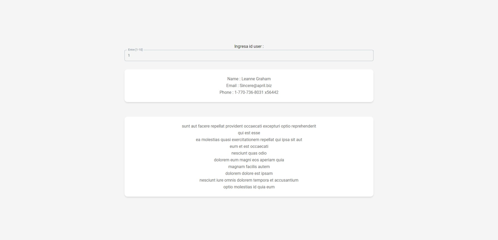

# 🚀 myprojectapi02

[](https://reactjs.org/)
[](https://vitejs.dev/)
[](https://redux-toolkit.js.org/)
[](https://tailwindcss.com/)
[](https://www.material-tailwind.com/)
[](LICENSE)

> **Single Page Application (SPA)** para búsqueda y visualización de perfiles de usuarios con arquitectura Feature-Based y diseño Glassmorphism.



---

## 📋 Tabla de Contenidos

- [Descripción](#-descripción)
- [Características](#-características)
- [Stack Tecnológico](#-stack-tecnológico)
- [Arquitectura](#-arquitectura)
- [Instalación](#-instalación)
- [Scripts Disponibles](#-scripts-disponibles)
- [Estructura del Proyecto](#-estructura-del-proyecto)
- [Documentación](#-documentación)
- [Demo](#-demo)
- [Contribución](#-contribución)
- [Licencia](#-licencia)

---

## 📖 Descripción

**myprojectapi02** es una aplicación React moderna que permite buscar y visualizar perfiles de usuarios mediante su ID. Consume la API pública [JSONPlaceholder](https://jsonplaceholder.typicode.com/) para obtener datos de usuarios y sus publicaciones.

### Propósito

- 🎓 **Proyecto educativo** para demostrar patrones avanzados de React
- 🏗️ **Arquitectura escalable** con Feature-Based Architecture
- 📚 **Documentación completa** con guías técnicas y tutoriales
- 🎨 **Diseño moderno** con Glassmorphism y Dark Mode

---

## ✨ Características

### Funcionalidades

- ✅ **Búsqueda de usuarios** por ID (1-10)
- ✅ **Visualización de perfil** con información completa
- ✅ **Listado de publicaciones** en acordeones expandibles
- ✅ **Manejo robusto de estados** (loading, success, error, notFound)
- ✅ **Tema claro/oscuro** con persistencia en localStorage
- ✅ **Carga inicial automática** del usuario ID 1

### Características Técnicas

- ⚡ **Performance optimizada** con React.memo, useCallback, Promise.all
- 🎯 **Feature-Based Architecture** para escalabilidad
- 🔄 **Redux Toolkit** para gestión de estado global
- 🎨 **Glassmorphism UI** con TailwindCSS + Material Tailwind
- 📱 **Responsive design** (mobile, tablet, desktop)
- ♿ **Accesibilidad básica** con tooltips y contraste adecuado
- 📝 **PropTypes** para validación de props
- 🧩 **Custom Hooks** para lógica reutilizable
- 🔗 **Alias de importación** (`@/`) para imports limpios

---

## 🛠️ Stack Tecnológico

### Core

| Tecnología | Versión | Descripción |
|------------|---------|-------------|
| **React** | 18.2.0 | Framework UI |
| **Vite** | 5.0.8 | Build tool y dev server |
| **Redux Toolkit** | 2.9.0 | Gestión de estado global |
| **React-Redux** | 9.2.0 | Binding React-Redux |

### UI/UX

| Tecnología | Versión | Descripción |
|------------|---------|-------------|
| **TailwindCSS** | 3.4.1 | Framework CSS utility-first |
| **Material Tailwind** | 2.1.8 | Componentes UI |
| **Heroicons** | 2.2.0 | Iconos SVG |
| **Google Fonts** | - | Tipografía (Roboto) |

### Desarrollo

| Tecnología | Versión | Descripción |
|------------|---------|-------------|
| **ESLint** | 8.55.0 | Linter de código |
| **PostCSS** | 8.4.33 | Procesador CSS |
| **Autoprefixer** | 10.4.17 | Prefijos CSS automáticos |
| **PropTypes** | 15.8.1 | Validación de props |

### Despliegue

| Tecnología | Versión | Descripción |
|------------|---------|-------------|
| **GitHub Pages** | - | Hosting estático |
| **gh-pages** | 6.1.1 | Deploy automático |

---

## 🏗️ Arquitectura

Este proyecto implementa una **Feature-Based Architecture** combinada con **Layered Architecture** para máxima escalabilidad y mantenibilidad.

### Principios Arquitectónicos

- ✅ **Separation of Concerns** - Cada módulo tiene una responsabilidad única
- ✅ **DRY (Don't Repeat Yourself)** - Reutilización de código
- ✅ **SOLID Principles** - Especialmente Single Responsibility
- ✅ **Feature-Based** - Organización por funcionalidades de negocio
- ✅ **Layered** - Separación en capas (UI → Logic → Service → Data)

### Diagrama de Arquitectura

```
┌─────────────────────────────────────────────────────────┐
│                    Presentation Layer                    │
│              (React Components + JSX)                    │
└────────────────────┬────────────────────────────────────┘
                     │
┌────────────────────▼────────────────────────────────────┐
│                     Logic Layer                          │
│           (Custom Hooks + Redux Store)                   │
└────────────────────┬────────────────────────────────────┘
                     │
┌────────────────────▼────────────────────────────────────┐
│                   Service Layer                          │
│              (Business Logic)                            │
└────────────────────┬────────────────────────────────────┘
                     │
┌────────────────────▼────────────────────────────────────┐
│                    Data Layer                            │
│              (API Clients)                               │
└────────────────────┬────────────────────────────────────┘
                     │
┌────────────────────▼────────────────────────────────────┐
│                 External Services                        │
│            (JSONPlaceholder API)                         │
└─────────────────────────────────────────────────────────┘
```

### Patrones de Diseño Utilizados

- 🎯 **Feature-Based Architecture** - Organización por funcionalidades
- 🔄 **Flux Pattern** - Flujo unidireccional con Redux
- 🪝 **Custom Hooks Pattern** - Encapsulación de lógica reutilizable
- 🎭 **Container/Presenter Pattern** - Separación de lógica y presentación
- 🔧 **Service Layer Pattern** - Orquestación de llamadas a API
- 📦 **Repository Pattern** - Abstracción de acceso a datos
- 💾 **Memoization Pattern** - Optimización de renders

---

## 📦 Instalación

### Prerrequisitos

- **Node.js** >= 16.x
- **pnpm** >= 8.x (recomendado) o npm >= 9.x

### Pasos

```bash
# 1. Clonar el repositorio
git clone https://github.com/slinkter/myprojectapi02.git
cd myprojectapi02

# 2. Instalar dependencias
pnpm install

# 3. Iniciar servidor de desarrollo
pnpm run dev

# 4. Abrir en navegador
# http://localhost:5173
```

---

## 📜 Scripts Disponibles

| Script | Comando | Descripción |
|--------|---------|-------------|
| **Desarrollo** | `pnpm run dev` | Inicia servidor de desarrollo con HMR |
| **Build** | `pnpm run build` | Genera bundle de producción optimizado |
| **Preview** | `pnpm run preview` | Previsualiza build de producción |
| **Lint** | `pnpm run lint` | Ejecuta ESLint para verificar calidad |
| **Deploy** | `pnpm run deploy` | Despliega a GitHub Pages |

---

## 📁 Estructura del Proyecto

```
myprojectapi02/
├── public/                     # Archivos estáticos
├── src/
│   ├── features/               # 🎯 Features (Feature-Based Architecture)
│   │   └── user-search/        # Feature: Búsqueda de usuarios
│   │       ├── api/            # APIs específicas del feature
│   │       │   ├── user.api.js
│   │       │   └── post.api.js
│   │       ├── components/     # Componentes del feature
│   │       │   ├── UserProfile.jsx
│   │       │   ├── PostList.jsx
│   │       │   └── skeletons/
│   │       ├── hooks/          # Hooks del feature
│   │       │   └── useUser.js
│   │       ├── redux/          # Estado del feature
│   │       │   └── userSlice.js
│   │       ├── services/       # Servicios del feature
│   │       │   └── user-service.js
│   │       ├── UserSearchPage.jsx
│   │       └── index.js        # Barrel export
│   │
│   ├── components/             # 🧩 Componentes UI globales
│   │   ├── ui/                 # Componentes UI reutilizables
│   │   │   ├── ErrorMessage.jsx
│   │   │   ├── NotFoundCard.jsx
│   │   │   └── ThemeToggleButton.jsx
│   │   └── layout/             # Layouts globales
│   │       └── MainLayout.jsx
│   │
│   ├── hooks/                  # 🪝 Custom hooks globales
│   │   └── useTheme.js
│   │
│   ├── redux/                  # 🗄️ Store global de Redux
│   │   └── store.js
│   │
│   ├── lib/                    # ⚙️ Configuraciones de librerías
│   │   └── api.config.js
│   │
│   ├── docs/                   # 📚 Documentación técnica
│   │   ├── 00-diagnostico-tecnico.md
│   │   ├── 01-overview-del-sistema.md
│   │   ├── 02-arquitectura.md
│   │   ├── 03-casos-de-uso.md
│   │   ├── 04-requerimientos.md
│   │   ├── 05-flujo-de-datos.md
│   │   ├── 06-guia-para-desarrolladores.md
│   │   ├── 07-calidad-y-riesgos.md
│   │   ├── 08-cierre-del-proyecto.md
│   │   └── GLOSSARY.md
│   │
│   ├── assets/                 # 🖼️ Recursos estáticos
│   ├── App.jsx                 # Componente raíz
│   ├── main.jsx                # Entry point
│   └── index.css               # Estilos globales (BEM)
│
├── .eslintrc.cjs               # Configuración ESLint
├── jsconfig.json               # Configuración de alias @/
├── vite.config.js              # Configuración Vite
├── tailwind.config.js          # Configuración Tailwind
├── postcss.config.js           # Configuración PostCSS
├── package.json
├── TODO-TESTING.md             # Guía para implementar testing
└── README.md                   # Este archivo
```

### Convenciones de Naming

| Tipo | Convención | Ejemplo |
|------|------------|---------|
| **Componentes** | PascalCase.jsx | `UserProfile.jsx` |
| **Hooks** | camelCase.js con `use` | `useUser.js` |
| **Services** | kebab-case.service.js | `user-service.js` |
| **APIs** | kebab-case.api.js | `user.api.js` |
| **Carpetas** | kebab-case | `user-search/` |

### Alias de Importación

El proyecto usa alias `@/` para imports absolutos:

```javascript
// ✅ Imports absolutos (recomendado)
import { UserSearchPage } from '@/features/user-search';
import MainLayout from '@/components/layout/MainLayout';
import { useTheme } from '@/hooks/useTheme';

// ✅ Imports relativos (dentro del mismo feature)
import UserProfile from './components/UserProfile';
import { useUser } from './hooks/useUser';
```

---

## 📚 Documentación

### Documentación Técnica Completa

El proyecto incluye **11 documentos técnicos** en `src/docs/`:

#### Bloque 1: Diagnóstico y Overview

- **[00-diagnostico-tecnico.md](./src/docs/00-diagnostico-tecnico.md)** - Análisis forense del proyecto
- **[01-overview-del-sistema.md](./src/docs/01-overview-del-sistema.md)** - Visión general del sistema

#### Bloque 2: Arquitectura y Diseño

- **[02-arquitectura.md](./src/docs/02-arquitectura.md)** - Arquitectura detallada con diagramas
- **[03-casos-de-uso.md](./src/docs/03-casos-de-uso.md)** - Casos de uso con flujos
- **[04-requerimientos.md](./src/docs/04-requerimientos.md)** - Requerimientos funcionales y no funcionales

#### Bloque 3: Implementación

- **[05-flujo-de-datos.md](./src/docs/05-flujo-de-datos.md)** - Flujo de datos con diagramas de secuencia
- **[06-guia-para-desarrolladores.md](./src/docs/06-guia-para-desarrolladores.md)** - Guía completa de desarrollo

#### Bloque 4: Calidad y Cierre

- **[07-calidad-y-riesgos.md](./src/docs/07-calidad-y-riesgos.md)** - Análisis de calidad y riesgos
- **[08-cierre-del-proyecto.md](./src/docs/08-cierre-del-proyecto.md)** - Cierre y roadmap futuro

#### Documentos Adicionales

- **[GLOSSARY.md](./src/docs/GLOSSARY.md)** - Glosario de términos técnicos
- **[TODO-TESTING.md](./TODO-TESTING.md)** - Guía para implementar testing

### Tutoriales

- **[tutorial.md](./tutorial.md)** - Tutorial paso a paso
- **[tutorial_completo.md](./tutorial_completo.md)** - Tutorial extendido con ejemplos

---

## 🌐 Demo

### Producción

🔗 **[https://slinkter.github.io/myprojectapi02](https://slinkter.github.io/myprojectapi02)**

### Desarrollo Local

```bash
pnpm run dev
# http://localhost:5173
```

---

## 🎨 Diseño

### Identidad Visual

- **Estilo:** Glassmorphism (vidrio esmerilado)
- **Paleta de Colores:**
  - Primario: Azul (#2196F3)
  - Fondo Claro: Gradiente gris-azul
  - Fondo Oscuro: Gradiente gris oscuro-azul oscuro
- **Tipografía:** Roboto (400, 500, 700)
- **Efectos:** Backdrop blur, transparencias, sombras suaves

### Características UX

- ✅ Responsive design (mobile-first)
- ✅ Dark mode completo
- ✅ Feedback visual inmediato
- ✅ Animaciones sutiles
- ✅ Tooltips informativos
- ✅ Estados de carga claros

---

## 🧪 Testing (TODO)

El proyecto incluye una guía completa para implementar testing en **[TODO-TESTING.md](./TODO-TESTING.md)**.

### Framework Recomendado

- **Vitest** - Framework de testing
- **React Testing Library** - Testing de componentes

### Objetivo de Cobertura

- **Hooks:** 80%
- **Services:** 80%
- **Redux Slices:** 80%
- **Componentes:** 60%
- **Total:** 70%

---

## 🤝 Contribución

Las contribuciones son bienvenidas. Por favor:

1. Fork el proyecto
2. Crea una rama para tu feature (`git checkout -b feature/nueva-funcionalidad`)
3. Commit tus cambios (`git commit -m 'feat: agregar nueva funcionalidad'`)
4. Push a la rama (`git push origin feature/nueva-funcionalidad`)
5. Abre un Pull Request

### Convenciones de Commits

Seguimos [Conventional Commits](https://www.conventionalcommits.org/):

```
feat: nueva funcionalidad
fix: corrección de bug
docs: cambios en documentación
style: cambios de formato
refactor: refactorización de código
test: agregar o modificar tests
chore: cambios en build, dependencias
```

---

## 📊 Métricas del Proyecto

| Métrica | Valor |
|---------|-------|
| **Componentes React** | 11 |
| **Custom Hooks** | 2 |
| **Redux Slices** | 1 |
| **Líneas de Código** | ~1,500 |
| **Bundle Size** | ~200KB |
| **Lighthouse Performance** | ~90 |
| **Documentos Técnicos** | 11 |

---

## 🎓 Nivel de Complejidad

**Clasificación:** Intermedio-Avanzado (Mid-Senior)

**Conceptos Aplicados:**
- ✅ Redux Toolkit con AsyncThunks
- ✅ Custom Hooks Pattern
- ✅ Container/Presenter Pattern
- ✅ Service Layer Pattern
- ✅ Feature-Based Architecture
- ✅ Optimización de renders (React.memo, useCallback)
- ✅ Manejo robusto de estados asíncronos
- ✅ Validación de props con PropTypes
- ✅ Metodología BEM para CSS

---

## 📄 Licencia

Este proyecto está bajo la Licencia MIT. Ver el archivo [LICENSE](LICENSE) para más detalles.

---

## 👨‍💻 Autor

**slinkterr**

- GitHub: [@slinkter](https://github.com/slinkter)
- Proyecto: [myprojectapi02](https://github.com/slinkter/myprojectapi02)

---

## 🙏 Agradecimientos

- [React](https://react.dev/) - Framework UI
- [Redux Toolkit](https://redux-toolkit.js.org/) - Gestión de estado
- [Vite](https://vitejs.dev/) - Build tool
- [TailwindCSS](https://tailwindcss.com/) - Framework CSS
- [Material Tailwind](https://www.material-tailwind.com/) - Componentes UI
- [JSONPlaceholder](https://jsonplaceholder.typicode.com/) - API de prueba

---

## 📞 Soporte

Si tienes preguntas o problemas:

1. Revisa la [documentación técnica](./src/docs/)
2. Consulta los [tutoriales](./tutorial_completo.md)
3. Abre un [issue](https://github.com/slinkter/myprojectapi02/issues)

---

**⭐ Si este proyecto te fue útil, considera darle una estrella en GitHub!**

---

*Última actualización: 12 de Enero, 2026*