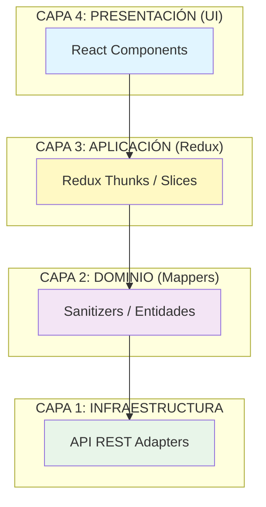
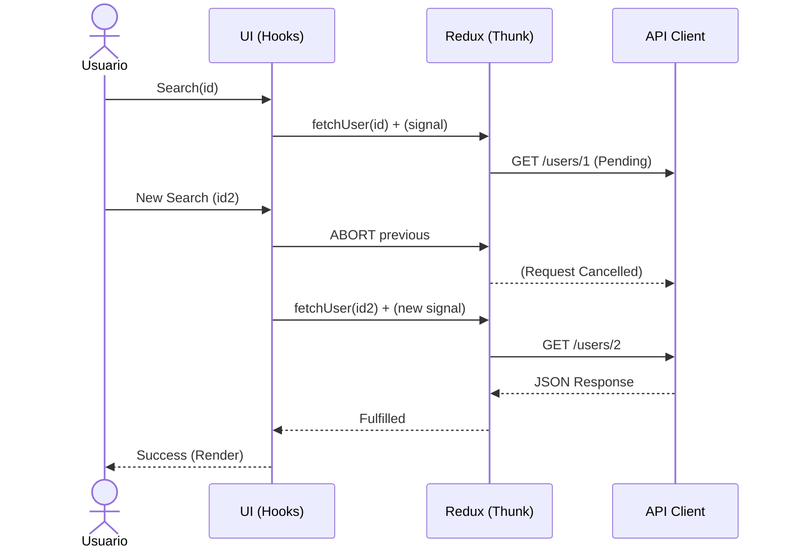
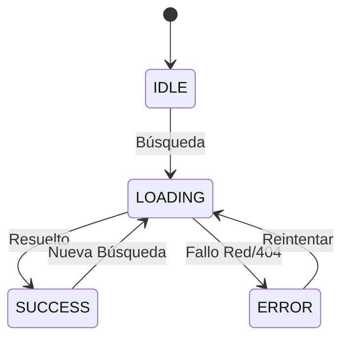

# UserApp Pro - Enterprise API Consumer

Una aplicación React de alto rendimiento diseñada bajo principios de **Clean Architecture**, enfocada en la resiliencia de datos, optimización de UX y patrones de diseño avanzados.

---

## 🗺️ Guía Visual del Proyecto

### 1. La "Cebolla" Arquitectónica (Capas Refinadas)


```mermaid
graph TD
    subgraph "CAPA 4: PRESENTACIÓN (UI)"
        UI[React Components]
    end
    subgraph "CAPA 3: APLICACIÓN (Redux)"
        STATE[Redux Thunks / Slices]
    end
    subgraph "CAPA 2: DOMINIO (Mappers)"
        DOMAIN[Sanitizers / Entidades]
    end
    subgraph "CAPA 1: INFRAESTRUCTURA"
        API[API REST Adapters]
    end

    UI --> STATE
    STATE --> DOMAIN
    DOMAIN --> API

    style UI fill:#e1f5ff
    style STATE fill:#fff9c4
    style DOMAIN fill:#f3e5f5
    style API fill:#e8f5e9
```

### 2. Diagrama de Secuencia: Flujo de Búsqueda con AbortController

Este diagrama describe el ciclo de vida de una petición, destacando la seguridad ante _race conditions_.


```mermaid
sequenceDiagram
    actor User as Usuario
    participant UI as UI (Hooks)
    participant Redux as Redux (Thunk)
    participant API as API Client

    User->>UI: Search(id)
    UI->>Redux: fetchUser(id) + (signal)
    Redux->>API: GET /users/1 (Pending)
    
    User->>UI: New Search (id2)
    UI->>Redux: ABORT previous
    Redux-->>API: (Request Cancelled)
    UI->>Redux: fetchUser(id2) + (new signal)
    Redux->>API: GET /users/2
    API-->>Redux: JSON Response
    Redux-->>UI: Fulfilled
    UI-->>User: Success (Render)
```

### 3. Arquitectura Cliente-Servidor (Infraestructura)


```mermaid
architecture-beta
    group client(cloud)[CLIENTE]
    service browser(internet)[React / Redux App] in client
    
    group server(cloud)[SERVIDOR]
    service api(server)[JSONPlaceholder API] in server
    
    browser:R -- L:api
```

### 4. Máquina de Estados (StateBoundary Logic)


```mermaid
stateDiagram-v2
    [*] --> IDLE
    IDLE --> LOADING : Búsqueda
    LOADING --> SUCCESS : Resuelto
    LOADING --> ERROR : Fallo Red/404
    SUCCESS --> LOADING : Nueva Búsqueda
    ERROR --> LOADING : Reintentar
```

---

## 🏗 Arquitectura y Patrones de Diseño

El proyecto no es un simple buscador; es una implementación de **Screaming Architecture** (Feature-Based) que aísla la lógica de negocio de la infraestructura.

### 1. Layered Architecture (Separación de Capas)

- **Infrastructure Layer (`api/`, `lib/api-client.js`):** Abstracción pura de red utilizando `fetch` con soporte nativo para `AbortController`.
- **Domain Layer (`domain/user.mappers.js`):** Implementación de **Mappers** (Anti-Corruption Layer) que sanitizan y transforman los datos crudos.
- **Application/Service Layer (`services/`):** Orquestación de lógica compleja (Modo Degradado).
- **State Management (`store/`):** Uso de **Redux Toolkit** con selectores memoizados (`createSelector`).

---

## 🚀 Optimizaciones de Ingeniería

### Resiliencia y Rendimiento

- **Gestión de Concurrencia:** Implementación de `AbortSignal` para abortar peticiones obsoletas.
- **Búsqueda Normalizada:** Algoritmo que ignora acentos, mayúsculas y espacios.
- **Debouncing de Validación:** Optimización del hilo principal durante el tipado.

---

## 📦 Stack Tecnológico y Trade-offs

| Tecnología        | Razón de la elección                              | Trade-off (Lo malo)                               |
| ----------------- | ------------------------------------------------- | ------------------------------------------------- |
| **Redux Toolkit** | Flujo de datos 100% predecible y centralizado.    | Añade más archivos que usar un simple `useState`. |
| **Tailwind v4**   | Estilizado ultra-rápido sin archivos CSS pesados. | Las clases en el HTML pueden verse desordenadas.  |
| **Data Mappers**  | Protege la UI de cambios en la API externa.       | Requiere escribir código extra de transformación. |
| **Vite**          | Recarga instantánea y construcción optimizada.    | Configuración mínima pero rígida.                 |

---

## 📚 Documentación Profunda

- [📖 Masterclass de Ingeniería](./src/docs/MASTERCLASS_INGENIERIA.md): Explicación línea a línea de los patrones.
- [🏗️ Arquitectura](./src/docs/architecture.md): Diagramas técnicos y flujo de datos.
- [🩺 Diagnóstico Técnico](./src/docs/00-diagnostico-tecnico.md): Por qué elegí este stack.

---

## 📖 Guía de Desarrollo

### Instalación

```bash
pnpm install
```

### Ejecución

```bash
pnpm dev
```

### Calidad de Código (Linting)

```bash
pnpm lint
```

---

> **Nota de Ingeniería:** Este proyecto cumple con los estándares de **Clean Code**, evitando el uso de "hardcoding" y garantizando que cada función tenga una única responsabilidad (SRP).
