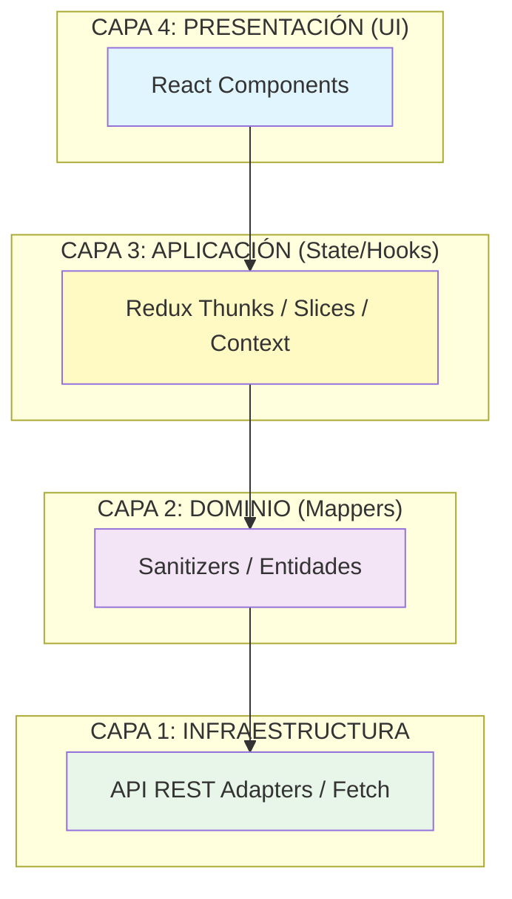
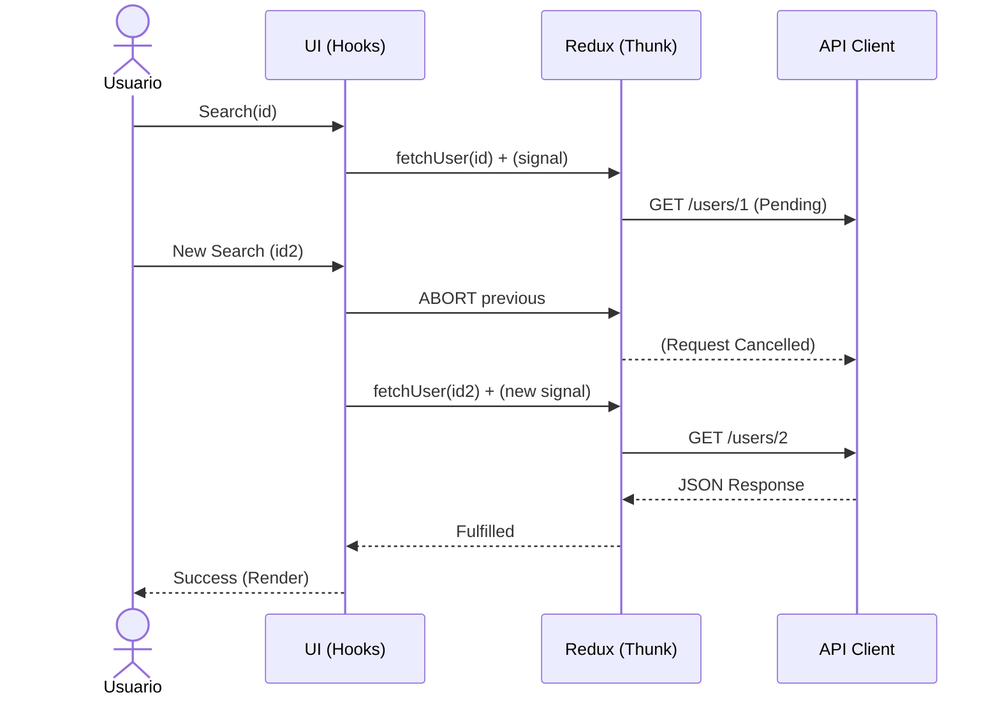

# UserApp Pro - Enterprise API Consumer

Una aplicación React de alto rendimiento diseñada bajo principios de **Clean Architecture**, enfocada en la resiliencia de datos, optimización de UX y patrones de diseño avanzados.

---

## 🗺️ Guía Visual del Proyecto

### 1. La "Cebolla" Arquitectónica (Capas Refinadas)


```mermaid
graph TD
    subgraph "CAPA 4: PRESENTACIÓN (UI)"
        UI[React Components]
    end
    subgraph "CAPA 3: APLICACIÓN (State/Hooks)"
        STATE[Redux Thunks / Slices / Context]
    end
    subgraph "CAPA 2: DOMINIO (Mappers)"
        DOMAIN[Sanitizers / Entidades]
    end
    subgraph "CAPA 1: INFRAESTRUCTURA"
        API[API REST Adapters / Fetch]
    end

    UI --> STATE
    STATE --> DOMAIN
    DOMAIN --> API

    style UI fill:#e1f5ff
    style STATE fill:#fff9c4
    style DOMAIN fill:#f3e5f5
    style API fill:#e8f5e9
```

### 2. Diagrama de Secuencia: Flujo de Búsqueda con AbortController

Este diagrama describe el ciclo de vida de una petición, destacando la seguridad ante _race conditions_.


```mermaid
sequenceDiagram
    actor User as Usuario
    participant UI as UI (Hooks)
    participant Redux as Redux (Thunk)
    participant API as API Client

    User->>UI: Search(id)
    UI->>Redux: fetchUser(id) + (signal)
    Redux->>API: GET /users/1 (Pending)
    
    User->>UI: New Search (id2)
    UI->>Redux: ABORT previous
    Redux-->>API: (Request Cancelled)
    UI->>Redux: fetchUser(id2) + (new signal)
    Redux->>API: GET /users/2
    API-->>Redux: JSON Response
    Redux-->>UI: Fulfilled
    UI-->>User: Success (Render)
```

---

## 🏗 Arquitectura y Capas

El proyecto implementa una **Arquitectura de Capas (Onion Architecture)** que aísla la lógica de negocio de la infraestructura externa:

1.  **Infraestructura (`api/`, `lib/`):** Adaptadores REST y configuración de red. Usa `fetch` con `AbortController`.
2.  **Dominio (`domain/`):** Implementación de **Mappers** (Capa Anti-Corrupción) para transformar datos de la API en entidades limpias.
3.  **Aplicación (`store/`, `hooks/`):** Gestión de estado global y hooks de orquestación.
4.  **Presentación (`components/`):** Componentes React puros y orquestadores (Smart/Dumb Components).

---

## 🧠 Estrategia de Gestión de Estado

Manejamos un enfoque híbrido para garantizar escalabilidad:

-   **Redux Toolkit:** Gestión del estado global y datos del dominio (Usuarios, Posts). Uso intensivo de Thunks y Selectores memoizados.
-   **Context API:** Utilizado para estados de UI transversales (ej. Sistema de Temas Dark/Light).
-   **useState:** Limitado estrictamente a estados locales efímeros de componentes.

---

## 🚀 Optimizaciones de Ingeniería

-   **Resiliencia:** Implementación de `AbortSignal` en todas las peticiones para evitar condiciones de carrera.
-   **Normalización:** Búsqueda insensible a acentos y mayúsculas.
-   **UX:** Uso de `StateBoundary` para manejar estados de carga, error y "no encontrado" de forma centralizada.

---

## 📦 Stack Tecnológico

| Tecnología | Razón de la elección |
| :--- | :--- |
| **React 18** | UI declarativa y concurrente. |
| **Redux Toolkit** | Flujo de datos predecible y centralizado. |
| **Tailwind CSS v4** | Estilizado ultra-rápido basado en utilidades de última generación. |
| **Vite** | Herramienta de construcción instantánea. |

---

## 📖 Guía de Desarrollo

### Requisitos Previos
- **Node.js:** v18 o superior.
- **pnpm:** Gestor de paquetes recomendado.

### Instalación
```bash
pnpm install
```

### Ejecución
```bash
pnpm dev
```

### Comandos Útiles
- `pnpm build`: Genera el bundle de producción.
- `pnpm lint`: Ejecuta el análisis de calidad de código.
- `pnpm deploy`: Despliega a GitHub Pages.

---

> **Referencia Técnica:** Para convenciones detalladas de codificación y guías de extensión, consulta el archivo [GEMINI.md](./GEMINI.md).
