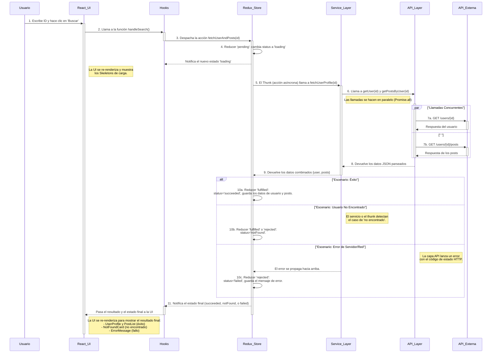

# Diagrama de Secuencia del Flujo de Datos

Este diagrama de secuencia ilustra el flujo completo de datos e interacciones en la aplicación de búsqueda de usuarios, desde la acción del usuario hasta la visualización de los resultados. Muestra cómo las diferentes capas del proyecto (UI, Hooks, Redux, Capa de Servicios y APIs) se comunican entre sí, incluyendo los diferentes escenarios de respuesta.

Puedes copiar y pegar el siguiente código directamente en [mermaid.live](https://mermaid.live) para visualizar el diagrama de forma interactiva.

