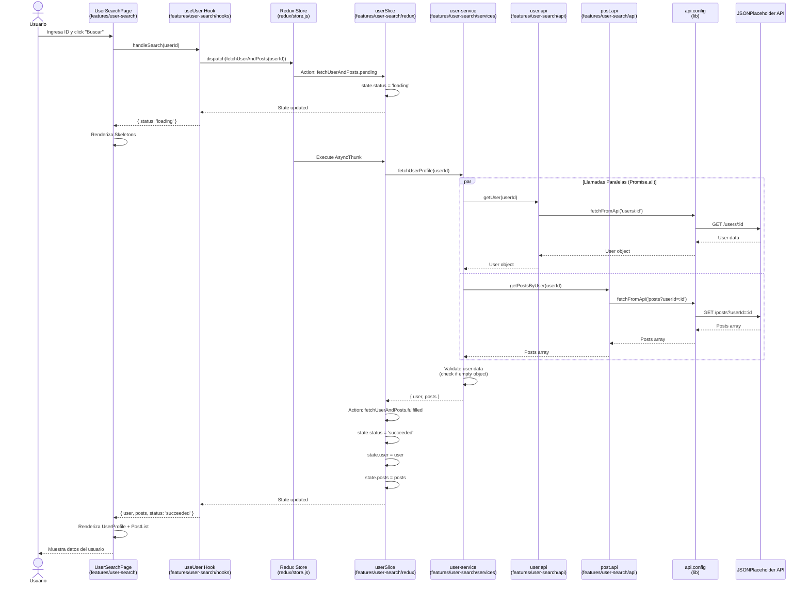
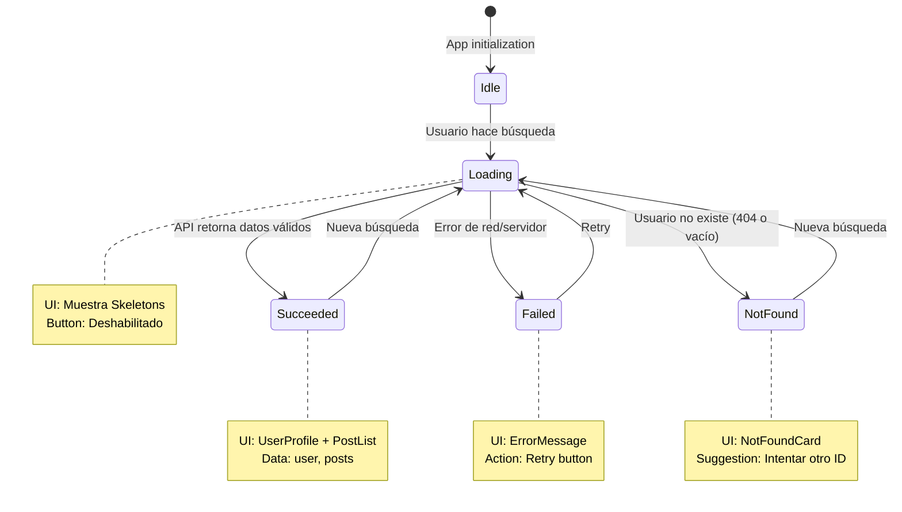

# 🔄 Diagrama de Secuencia - Búsqueda de Usuario

> **Proyecto:** myprojectapi02  
> **Arquitectura:** Feature-Based Architecture  
> **Última Actualización:** 12 de Enero, 2026

---

## 📊 Flujo Completo de Búsqueda de Usuario

Este diagrama muestra el flujo completo desde que el usuario hace clic en "Buscar" hasta que se muestran los resultados.



---

## 🔄 Flujo de Estados



---

## 📁 Estructura de Archivos Involucrados

### Feature: user-search

```
src/features/user-search/
├── UserSearchPage.jsx          # UI Component (Container)
├── hooks/
│   └── useUser.js              # Custom Hook (Logic Layer)
├── redux/
│   └── userSlice.js            # Redux Slice (State Management)
├── services/
│   └── user-service.js         # Business Logic (Service Layer)
└── api/
    ├── user.api.js             # User API Client
    └── post.api.js             # Post API Client
```

### Global Configuration

```
src/
├── lib/
│   └── api.config.js           # Base API Configuration
└── redux/
    └── store.js                # Redux Store Configuration
```

---

## 🎯 Responsabilidades por Capa

### 1. UI Layer (UserSearchPage.jsx)
- Renderizar interfaz de usuario
- Capturar eventos del usuario
- Mostrar estados visuales (loading, success, error)
- **NO** contiene lógica de negocio

### 2. Logic Layer (useUser.js)
- Encapsular lógica de interacción con Redux
- Gestionar estado local (inputValue, searchId)
- Proporcionar handlers (handleSearch, handleRetry)
- Conectar UI con Redux Store

### 3. State Management (userSlice.js)
- Definir estructura del estado
- Gestionar estados asíncronos (pending, fulfilled, rejected)
- Actualizar estado de forma inmutable
- **NO** contiene lógica de negocio

### 4. Service Layer (user-service.js)
- Orquestar llamadas a múltiples APIs
- Aplicar lógica de negocio (validaciones, transformaciones)
- Ejecutar llamadas en paralelo (Promise.all)
- **NO** accede directamente a Redux

### 5. Data Access Layer (*.api.js)
- Realizar llamadas HTTP
- Manejar errores de red
- Retornar datos crudos
- **NO** contiene lógica de negocio

### 6. Configuration Layer (api.config.js)
- Configuración base de fetch
- Manejo de errores HTTP
- Transformación de respuestas
- **NO** conoce endpoints específicos

---

## 🔍 Flujo de Datos Detallado

### Paso 1: Usuario Inicia Búsqueda
```javascript
// UserSearchPage.jsx
<Button onClick={handleSearch}>Buscar</Button>
```

### Paso 2: Hook Despacha Acción
```javascript
// useUser.js
const handleSearch = useCallback(() => {
    dispatch(fetchUserAndPosts(Number(inputValue)));
}, [dispatch, inputValue]);
```

### Paso 3: Redux Ejecuta AsyncThunk
```javascript
// userSlice.js
export const fetchUserAndPosts = createAsyncThunk(
    'user/fetchUserAndPosts',
    async (userId, { rejectWithValue }) => {
        const data = await fetchUserProfile(userId);
        return data;
    }
);
```

### Paso 4: Servicio Orquesta APIs
```javascript
// user-service.js
export const fetchUserProfile = async (userId) => {
    const [user, posts] = await Promise.all([
        getUser(userId),
        getPostsByUser(userId),
    ]);
    
    if (user && Object.keys(user).length === 0) {
        return { user: null, posts: [] };
    }
    
    return { user, posts };
};
```

### Paso 5: APIs Realizan Llamadas
```javascript
// user.api.js
export const getUser = (userId) => {
    return fetchFromApi(`users/${userId}`);
};

// post.api.js
export const getPostsByUser = (userId) => {
    return fetchFromApi(`posts?userId=${userId}`);
};
```

### Paso 6: Configuración Base Ejecuta Fetch
```javascript
// api.config.js
export const fetchFromApi = async (endpoint) => {
    const response = await fetch(`${API_BASE_URL}/${endpoint}`);
    
    if (!response.ok) {
        throw new Error(`HTTP ${response.status}`);
    }
    
    return response.json();
};
```

---

## ✅ Ventajas de Esta Arquitectura

1. **Separación de Responsabilidades**
   - Cada capa tiene una responsabilidad única y bien definida

2. **Testabilidad**
   - Cada capa puede testearse de forma aislada
   - Fácil mockear dependencias

3. **Mantenibilidad**
   - Cambios en una capa no afectan a otras
   - Código organizado y predecible

4. **Escalabilidad**
   - Fácil agregar nuevos features
   - Estructura consistente

5. **Reutilización**
   - Servicios y APIs pueden reutilizarse
   - Custom Hooks encapsulan lógica compleja

---

**Última Actualización:** 12 de Enero, 2026  
**Arquitectura:** Feature-Based + Layered
