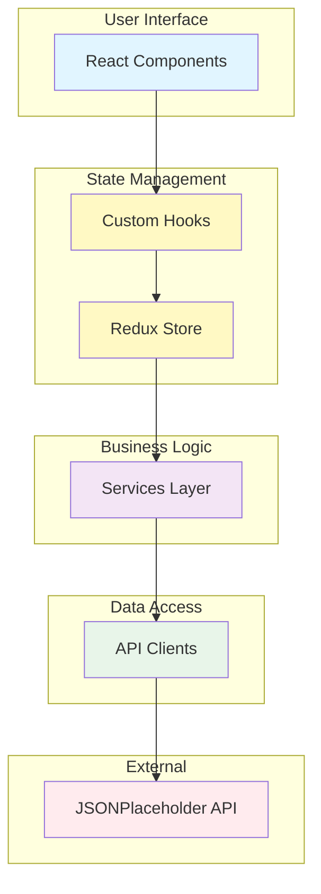
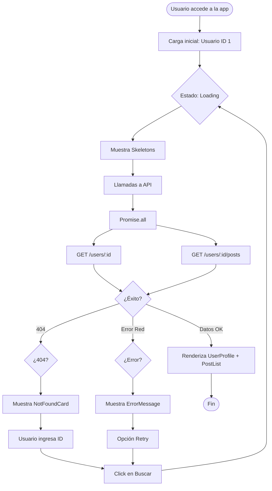
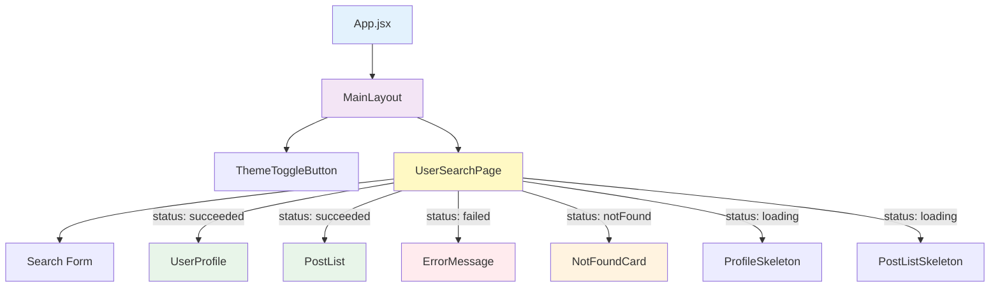

# 🌐 Overview del Sistema

> **Proyecto:** myprojectapi02  
> **Tipo:** Single Page Application (SPA)  
> **Propósito:** Búsqueda y visualización de perfiles de usuarios  
> **Última Actualización:** 12 de Enero, 2026

---

## 📋 Descripción del Proyecto

**myprojectapi02** es una aplicación web moderna desarrollada en React que permite a los usuarios buscar y visualizar perfiles de usuarios mediante su ID. La aplicación consume la API pública JSONPlaceholder para obtener información de usuarios y sus publicaciones, presentando los datos en una interfaz elegante con diseño Glassmorphism y soporte para modo oscuro.

### Propósito

El proyecto sirve como:
- 📚 **Demostración técnica** de arquitectura React moderna
- 🎓 **Proyecto educativo** para aprender patrones avanzados de React
- 🏗️ **Base escalable** para aplicaciones más complejas

---

## 🎯 Alcance Funcional

### Funcionalidades Principales

#### 1. Búsqueda de Usuarios
- Búsqueda por ID (rango 1-10)
- Validación de entrada en tiempo real
- Feedback visual durante la búsqueda

#### 2. Visualización de Perfil
- Información personal del usuario
- Datos de la empresa
- Información de contacto (email, sitio web)
- Ubicación (ciudad)
- Avatar generado dinámicamente

#### 3. Listado de Publicaciones
- Posts del usuario seleccionado
- Acordeones expandibles
- Indicador de "sin publicaciones"

#### 4. Manejo de Estados
- Estado de carga con skeletons animados
- Manejo de errores con opción de reintentar
- Estado "usuario no encontrado"
- Estado inicial (idle)

#### 5. Tema Visual
- Modo claro y oscuro
- Toggle de tema persistente
- Transiciones suaves

### Funcionalidades Técnicas

- ✅ Gestión de estado global con Redux Toolkit
- ✅ Llamadas asíncronas con AsyncThunks
- ✅ Optimización de renders con React.memo
- ✅ Custom Hooks para lógica reutilizable
- ✅ Validación de props con PropTypes
- ✅ Responsive design
- ✅ Accesibilidad (tooltips, semántica HTML)

---

## 🛠️ Tecnologías Utilizadas

### Core Stack

| Tecnología | Versión | Propósito |
|------------|---------|-----------|
| **React** | 18.2.0 | Framework UI |
| **Vite** | 5.0.8 | Build tool y dev server |
| **Redux Toolkit** | 2.9.0 | Gestión de estado global |
| **React-Redux** | 9.2.0 | Binding React-Redux |

### UI/UX

| Tecnología | Versión | Propósito |
|------------|---------|-----------|
| **Material Tailwind** | 2.1.8 | Componentes UI |
| **TailwindCSS** | 3.4.1 | Framework CSS utility-first |
| **Heroicons** | 2.2.0 | Iconos SVG |
| **Google Fonts** | - | Tipografía (Roboto) |

### Desarrollo

| Tecnología | Versión | Propósito |
|------------|---------|-----------|
| **ESLint** | 8.55.0 | Linter de código |
| **PostCSS** | 8.4.33 | Procesador CSS |
| **Autoprefixer** | 10.4.17 | Prefijos CSS automáticos |
| **PropTypes** | 15.8.1 | Validación de props |

### Despliegue

| Tecnología | Versión | Propósito |
|------------|---------|-----------|
| **GitHub Pages** | - | Hosting estático |
| **gh-pages** | 6.1.1 | Deploy automático |

---

## 🏗️ Arquitectura General

### Patrón Arquitectónico

**Feature-Based Architecture + Layered Architecture**



### Capas de la Aplicación

1. **Presentation Layer** - Componentes React (UI)
2. **Logic Layer** - Custom Hooks + Redux
3. **Service Layer** - Lógica de negocio
4. **Data Layer** - Clientes API

---

## 🔄 Flujo Principal de la Aplicación



---

## 📊 Diagrama de Componentes



---

## 🌍 Integración con APIs Externas

### JSONPlaceholder API

**Base URL:** `https://jsonplaceholder.typicode.com`

#### Endpoints Utilizados

| Endpoint | Método | Descripción | Respuesta |
|----------|--------|-------------|-----------|
| `/users/:id` | GET | Obtiene datos de un usuario | Objeto User |
| `/users/:id/posts` | GET | Obtiene posts de un usuario | Array de Posts |

#### Estructura de Datos

**User Object:**
```json
{
  "id": 1,
  "name": "Leanne Graham",
  "username": "Bret",
  "email": "Sincere@april.biz",
  "address": {
    "city": "Gwenborough"
  },
  "website": "hildegard.org",
  "company": {
    "name": "Romaguera-Crona",
    "catchPhrase": "Multi-layered client-server neural-net"
  }
}
```

**Post Object:**
```json
{
  "userId": 1,
  "id": 1,
  "title": "sunt aut facere repellat provident",
  "body": "quia et suscipit..."
}
```

---

## 🎨 Diseño Visual

### Identidad Visual

- **Estilo:** Glassmorphism (vidrio esmerilado)
- **Paleta de Colores:**
  - Primario: Azul (#2196F3)
  - Fondo Claro: Gradiente gris-azul
  - Fondo Oscuro: Gradiente gris oscuro-azul oscuro
- **Tipografía:** Roboto (400, 500, 700)
- **Efectos:** Backdrop blur, transparencias, sombras suaves

### Características UX

- ✅ Responsive design (mobile-first)
- ✅ Dark mode completo
- ✅ Feedback visual inmediato
- ✅ Animaciones sutiles
- ✅ Tooltips informativos
- ✅ Estados de carga claros

---

## 📱 Compatibilidad

### Navegadores Soportados

- ✅ Chrome/Edge (últimas 2 versiones)
- ✅ Firefox (últimas 2 versiones)
- ✅ Safari (últimas 2 versiones)
- ✅ Opera (últimas 2 versiones)

### Dispositivos

- ✅ Desktop (1024px+)
- ✅ Tablet (768px - 1023px)
- ✅ Mobile (320px - 767px)

---

## 🚀 Despliegue

### Entorno de Producción

- **Hosting:** GitHub Pages
- **URL:** `https://slinkter.github.io/myprojectapi02`
- **Deploy:** Manual con `pnpm run deploy`

### Entorno de Desarrollo

- **Dev Server:** Vite (puerto 5173)
- **Hot Reload:** Activado
- **Comando:** `pnpm run dev`

---

## 📈 Métricas del Proyecto

| Métrica | Valor |
|---------|-------|
| **Componentes React** | 11 |
| **Custom Hooks** | 2 |
| **Redux Slices** | 1 |
| **Servicios** | 1 |
| **Líneas de Código** | ~1,500 |
| **Dependencias** | 8 |
| **Dev Dependencies** | 11 |
| **Tamaño Bundle (estimado)** | ~200KB |

---

## 🎓 Nivel de Complejidad

**Clasificación:** Intermedio-Avanzado

**Conceptos Aplicados:**
- ✅ Redux Toolkit con AsyncThunks
- ✅ Custom Hooks Pattern
- ✅ Container/Presenter Pattern
- ✅ Service Layer Pattern
- ✅ Optimización de renders (React.memo, useCallback)
- ✅ Manejo robusto de estados asíncronos
- ✅ Validación de props
- ✅ Metodología BEM para CSS

---

## 📚 Documentación Relacionada

- [00 - Diagnóstico Técnico](./00-diagnostico-tecnico.md)
- [02 - Arquitectura](./02-arquitectura.md)
- [03 - Casos de Uso](./03-casos-de-uso.md)
- [04 - Requerimientos](./04-requerimientos.md)
- [05 - Flujo de Datos](./05-flujo-de-datos.md)
- [06 - Guía para Desarrolladores](./06-guia-para-desarrolladores.md)
- [07 - Calidad y Riesgos](./07-calidad-y-riesgos.md)
- [08 - Cierre del Proyecto](./08-cierre-del-proyecto.md)

---

## 🏁 Conclusión

**myprojectapi02** es una aplicación React moderna que demuestra la implementación de patrones avanzados de desarrollo frontend. Con una arquitectura sólida, diseño elegante y código bien organizado, sirve como excelente base para proyectos más complejos o como referencia educativa para desarrolladores que buscan mejorar sus habilidades en React y Redux.

---

**Firma Digital:**  
🏛️ Arquitecto de Software Senior  
📅 12 de Enero, 2026
