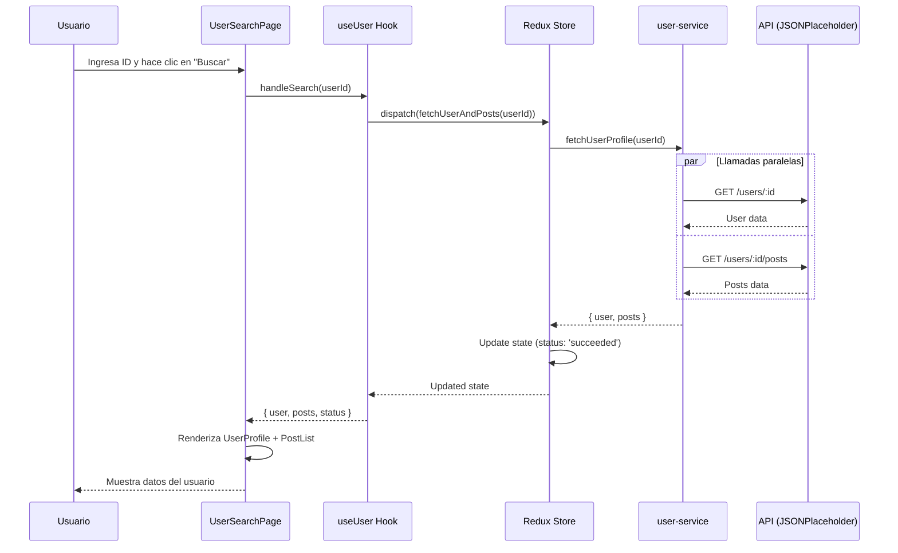
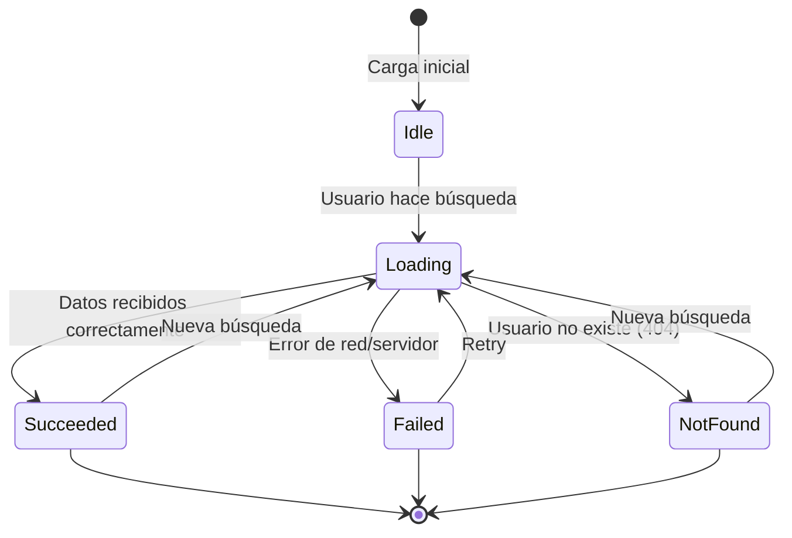
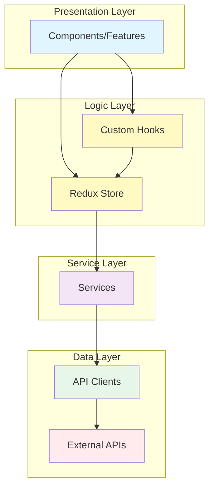
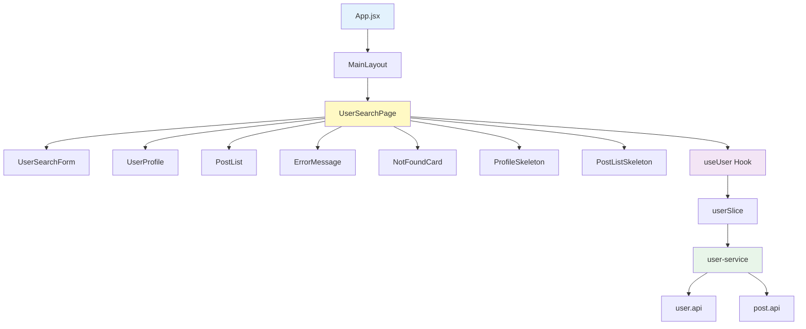

# 🏗️ Arquitectura del Sistema

> **Proyecto:** myprojectapi02  
> **Tipo:** Single Page Application (SPA)  
> **Patrón Arquitectónico:** Feature-Based Architecture + Layered Architecture  
> **Última Actualización:** 12 de Enero, 2026

---

## 📋 Tabla de Contenidos

1. [Visión General](#visión-general)
2. [Arquitectura Actual vs Propuesta](#arquitectura-actual-vs-propuesta)
3. [Estructura de Carpetas Propuesta](#estructura-de-carpetas-propuesta)
4. [Responsabilidades por Capa](#responsabilidades-por-capa)
5. [Patrones de Diseño Utilizados](#patrones-de-diseño-utilizados)
6. [Flujo de Datos](#flujo-de-datos)
7. [Convenciones de Naming](#convenciones-de-naming)
8. [Configuración de Rutas Absolutas](#configuración-de-rutas-absolutas)
9. [Diagramas de Arquitectura](#diagramas-de-arquitectura)

---

## 🎯 Visión General

El proyecto implementa una **arquitectura híbrida** que combina:

- **Feature-Based Architecture:** Organización por funcionalidades de negocio
- **Layered Architecture:** Separación de responsabilidades en capas (UI → Logic → Data)
- **Flux Pattern:** Redux Toolkit para gestión de estado unidireccional

### Principios Arquitectónicos

- ✅ **Separation of Concerns:** Cada módulo tiene una responsabilidad única
- ✅ **DRY (Don't Repeat Yourself):** Reutilización de componentes y lógica
- ✅ **SOLID Principles:** Especialmente Single Responsibility y Dependency Inversion
- ✅ **Scalability:** Estructura preparada para crecer con nuevos features
- ✅ **Maintainability:** Código organizado y fácil de mantener

---

## 🔄 Arquitectura Actual vs Propuesta

### Arquitectura Actual (Híbrida)

```
src/
├── features/              # ⚠️ Solo 1 feature
│   └── UserSearch/
├── components/            # ⚠️ Mezcla genéricos + específicos
├── hooks/                 # ⚠️ Mezcla globales + específicos
├── redux/                 # ✅ Centralizado
├── services/              # ✅ Capa de servicios
└── api/                   # ✅ Capa de datos
```

**Problemas:**
- Componentes específicos (`UserProfile`, `PostList`) fuera de `features/`
- Hooks específicos (`useUser`) en carpeta global
- Inconsistencia en organización

### Arquitectura Propuesta (Feature-Based Pura)

```
src/
├── features/              # ✅ Todos los features aquí
│   └── user-search/       # ✅ Feature completo y autocontenido
│       ├── components/
│       ├── hooks/
│       ├── redux/
│       ├── services/
│       └── index.js
├── components/            # ✅ Solo componentes UI genéricos
├── hooks/                 # ✅ Solo hooks globales
├── lib/                   # ✅ Configuraciones de librerías
├── routes/                # ✅ Configuración de rutas
└── utils/                 # ✅ Utilidades globales
```

**Beneficios:**
- ✅ Features autocontenidos y cohesivos
- ✅ Fácil de escalar (agregar nuevos features)
- ✅ Separación clara entre global y específico
- ✅ Mejor mantenibilidad

---

## 📁 Estructura de Carpetas Propuesta

### Estructura Completa

```
myprojectapi02/
├── public/
│   └── vite.svg
├── src/
│   ├── features/                    # 🎯 Módulos de dominio (Feature-Based)
│   │   └── user-search/             # Feature: Búsqueda de usuarios
│   │       ├── components/          # Componentes específicos del feature
│   │       │   ├── UserProfile.jsx
│   │       │   ├── PostList.jsx
│   │       │   ├── UserSearchForm.jsx
│   │       │   └── skeletons/
│   │       │       ├── ProfileSkeleton.jsx
│   │       │       └── PostListSkeleton.jsx
│   │       ├── hooks/               # Hooks específicos del feature
│   │       │   └── useUser.js
│   │       ├── redux/               # Estado específico del feature
│   │       │   └── userSlice.js
│   │       ├── services/            # Servicios específicos del feature
│   │       │   └── user-service.js
│   │       ├── api/                 # APIs específicas del feature
│   │       │   ├── user.api.js
│   │       │   └── post.api.js
│   │       ├── UserSearchPage.jsx   # Página principal del feature
│   │       └── index.js             # Barrel export
│   │
│   ├── components/                  # 🧩 Componentes UI reutilizables (globales)
│   │   ├── ui/                      # Componentes UI básicos
│   │   │   ├── ErrorMessage.jsx
│   │   │   ├── NotFoundCard.jsx
│   │   │   └── ThemeToggleButton.jsx
│   │   └── layout/                  # Componentes de layout
│   │       └── MainLayout.jsx
│   │
│   ├── hooks/                       # 🪝 Custom hooks globales
│   │   └── useTheme.js
│   │
│   ├── redux/                       # 🗄️ Configuración global de Redux
│   │   └── store.js
│   │
│   ├── lib/                         # ⚙️ Configuraciones de librerías externas
│   │   ├── api.config.js            # Configuración base de API (antes api/api.js)
│   │   └── tailwind.js              # Helpers de Tailwind (si necesario)
│   │
│   ├── routes/                      # 🛣️ Configuración de rutas (futuro)
│   │   └── index.jsx
│   │
│   ├── utils/                       # 🛠️ Utilidades globales
│   │   ├── validators.js
│   │   └── formatters.js
│   │
│   ├── assets/                      # 🖼️ Recursos estáticos
│   │   └── react.svg
│   │
│   ├── docs/                        # 📚 Documentación del proyecto
│   │   ├── 00-diagnostico-tecnico.md
│   │   ├── 01-overview-del-sistema.md
│   │   ├── 02-arquitectura.md
│   │   ├── 03-casos-de-uso.md
│   │   ├── 04-requerimientos.md
│   │   ├── 05-flujo-de-datos.md
│   │   ├── 06-guia-para-desarrolladores.md
│   │   ├── 07-calidad-y-riesgos.md
│   │   ├── 08-cierre-del-proyecto.md
│   │   ├── tutorial_completo.md
│   │   └── GLOSSARY.md
│   │
│   ├── App.jsx                      # Componente raíz
│   ├── main.jsx                     # Entry point
│   ├── index.css                    # Estilos globales
│   └── App.css                      # Estilos del componente App
│
├── .eslintrc.cjs                    # Configuración de ESLint
├── .gitignore
├── index.html                       # HTML principal
├── jsconfig.json                    # Configuración de JavaScript (alias)
├── package.json
├── pnpm-lock.yaml
├── postcss.config.js                # Configuración de PostCSS
├── tailwind.config.js               # Configuración de Tailwind
├── vite.config.js                   # Configuración de Vite
├── README.md                        # Documentación principal
└── .env.example                     # Variables de entorno de ejemplo
```

---

## 🎭 Responsabilidades por Capa

### 1. Features Layer (`src/features/`)

**Responsabilidad:** Encapsular funcionalidades de negocio completas y autocontenidas.

**Características:**
- Cada feature es un módulo independiente
- Contiene todo lo necesario para funcionar (componentes, hooks, estado, servicios)
- Puede importar de `components/`, `hooks/`, `lib/`, `utils/` (globales)
- NO puede importar de otros features (evitar acoplamiento)

**Ejemplo: `user-search/`**
```javascript
// src/features/user-search/index.js (Barrel export)
export { default as UserSearchPage } from './UserSearchPage';
export { useUser } from './hooks/useUser';
```

**Uso en App:**
```javascript
// src/App.jsx
import { UserSearchPage } from '@/features/user-search';
```

---

### 2. Components Layer (`src/components/`)

**Responsabilidad:** Componentes UI reutilizables y genéricos.

**Reglas:**
- ✅ Solo componentes que pueden usarse en múltiples features
- ✅ Sin lógica de negocio específica
- ✅ Reciben datos por props
- ❌ NO deben importar de `features/`

**Subdivisiones:**

#### `components/ui/`
Componentes UI básicos (botones, inputs, cards genéricos, alerts, etc.)

**Ejemplos:**
- `ErrorMessage.jsx` - Mensaje de error genérico
- `NotFoundCard.jsx` - Card de "no encontrado"
- `ThemeToggleButton.jsx` - Botón de cambio de tema

#### `components/layout/`
Componentes de estructura de página

**Ejemplos:**
- `MainLayout.jsx` - Layout principal con header/footer
- `Sidebar.jsx` - Barra lateral (futuro)
- `Header.jsx` - Encabezado (futuro)

---

### 3. Hooks Layer (`src/hooks/`)

**Responsabilidad:** Custom hooks globales reutilizables.

**Reglas:**
- ✅ Solo hooks que pueden usarse en múltiples features
- ✅ Lógica genérica (tema, autenticación, window size, etc.)
- ❌ NO hooks específicos de un feature

**Ejemplos:**
- `useTheme.js` - Manejo de tema claro/oscuro
- `useLocalStorage.js` - Persistencia en localStorage (futuro)
- `useDebounce.js` - Debounce de valores (futuro)

---

### 4. Redux Layer (`src/redux/`)

**Responsabilidad:** Configuración global del store de Redux.

**Contenido:**
- `store.js` - Configuración del store con todos los slices

**Nota:** Los slices específicos de features van en `features/[feature]/redux/`

```javascript
// src/redux/store.js
import { configureStore } from '@reduxjs/toolkit';
import userReducer from '@/features/user-search/redux/userSlice';

export const store = configureStore({
    reducer: {
        user: userReducer,
        // Futuros reducers aquí
    },
});
```

---

### 5. Lib Layer (`src/lib/`)

**Responsabilidad:** Configuraciones de librerías externas.

**Ejemplos:**
- `api.config.js` - Configuración base de fetch/axios
- `firebase.config.js` - Configuración de Firebase (si se usa)
- `analytics.js` - Configuración de analytics (futuro)

---

### 6. Routes Layer (`src/routes/`)

**Responsabilidad:** Configuración de rutas de la aplicación (futuro).

**Ejemplo:**
```javascript
// src/routes/index.jsx (futuro con React Router)
import { createBrowserRouter } from 'react-router-dom';
import { UserSearchPage } from '@/features/user-search';

export const router = createBrowserRouter([
    {
        path: '/',
        element: <UserSearchPage />,
    },
]);
```

---

### 7. Utils Layer (`src/utils/`)

**Responsabilidad:** Funciones utilitarias globales.

**Ejemplos:**
- `validators.js` - Funciones de validación
- `formatters.js` - Funciones de formateo (fechas, números, etc.)
- `constants.js` - Constantes globales

---

### 8. Assets Layer (`src/assets/`)

**Responsabilidad:** Recursos estáticos (imágenes, fuentes, etc.)

---

### 9. Docs Layer (`src/docs/`)

**Responsabilidad:** Documentación técnica del proyecto.

**Estructura numerada (00-08):**
- `00-diagnostico-tecnico.md`
- `01-overview-del-sistema.md`
- `02-arquitectura.md`
- `03-casos-de-uso.md`
- `04-requerimientos.md`
- `05-flujo-de-datos.md`
- `06-guia-para-desarrolladores.md`
- `07-calidad-y-riesgos.md`
- `08-cierre-del-proyecto.md`

---

## 🎨 Patrones de Diseño Utilizados

### 1. Feature-Based Architecture

**Descripción:** Organización por funcionalidades de negocio en lugar de por tipo de archivo.

**Beneficios:**
- ✅ Alta cohesión: Todo lo relacionado a un feature está junto
- ✅ Bajo acoplamiento: Features independientes entre sí
- ✅ Escalabilidad: Fácil agregar nuevos features
- ✅ Mantenibilidad: Fácil encontrar y modificar código

**Ejemplo:**
```
features/
├── user-search/      # Todo sobre búsqueda de usuarios
├── auth/             # Todo sobre autenticación (futuro)
└── dashboard/        # Todo sobre dashboard (futuro)
```

---

### 2. Container/Presenter Pattern

**Descripción:** Separación entre componentes con lógica (Containers) y componentes de presentación (Presenters).

**Implementación:**

**Container (Smart Component):**
```javascript
// UserSearchPage.jsx (Container)
function UserSearchPage() {
    const { user, posts, status, handleSearch } = useUser();
    
    return (
        <div>
            <UserSearchForm onSearch={handleSearch} />
            <UserProfile user={user} />
            <PostList posts={posts} />
        </div>
    );
}
```

**Presenter (Dumb Component):**
```javascript
// UserProfile.jsx (Presenter)
function UserProfile({ user }) {
    return (
        <Card>
            <Typography>{user.name}</Typography>
            {/* Solo presentación, sin lógica */}
        </Card>
    );
}
```

---

### 3. Custom Hooks Pattern

**Descripción:** Encapsular lógica reutilizable en hooks personalizados.

**Beneficios:**
- ✅ Reutilización de lógica
- ✅ Separación de concerns
- ✅ Testing más fácil

**Ejemplo:**
```javascript
// useUser.js
export const useUser = (initialUserId) => {
    const dispatch = useDispatch();
    const { user, posts, status } = useSelector(state => state.user);
    
    const handleSearch = useCallback((userId) => {
        dispatch(fetchUserAndPosts(userId));
    }, [dispatch]);
    
    return { user, posts, status, handleSearch };
};
```

---

### 4. Service Layer Pattern

**Descripción:** Capa intermedia entre componentes/Redux y APIs para orquestar lógica de negocio.

**Beneficios:**
- ✅ Lógica de negocio centralizada
- ✅ APIs más limpias
- ✅ Fácil de testear

**Ejemplo:**
```javascript
// user-service.js
export const fetchUserProfile = async (userId) => {
    const [user, posts] = await Promise.all([
        getUser(userId),
        getPostsByUser(userId),
    ]);
    
    if (user && Object.keys(user).length === 0) {
        return { user: null, posts: [] };
    }
    
    return { user, posts };
};
```

---

### 5. Repository Pattern (Implícito)

**Descripción:** Abstracción de acceso a datos.

**Implementación:**
```javascript
// user.api.js
export const getUser = (userId) => {
    return fetchFromApi(`users/${userId}`);
};
```

---

### 6. Flux Pattern (Redux)

**Descripción:** Flujo unidireccional de datos.

**Flujo:**
```
Component → Action → Reducer → Store → Component
```

---

### 7. Memoization Pattern

**Descripción:** Optimización de renders con `React.memo`, `useMemo`, `useCallback`.

**Ejemplo:**
```javascript
const UserProfile = React.memo(({ user }) => {
    // Solo re-renderiza si user cambia
});
```

---

## 🔄 Flujo de Datos

### Flujo Principal: Búsqueda de Usuario



### Estados del Flujo



---

## 📝 Convenciones de Naming

### Archivos y Carpetas

| Tipo | Convención | Ejemplo |
|------|------------|---------|
| **Componentes React** | PascalCase.jsx | `UserProfile.jsx` |
| **Hooks** | camelCase.js con prefijo `use` | `useUser.js` |
| **Services** | kebab-case.service.js | `user-service.js` |
| **APIs** | kebab-case.api.js | `user.api.js` |
| **Utils** | kebab-case.util.js | `validators.util.js` |
| **Slices Redux** | camelCase.slice.js | `userSlice.js` |
| **Carpetas** | kebab-case | `user-search/` |
| **Constantes** | UPPER_SNAKE_CASE.js | `API_CONSTANTS.js` |

### Variables y Funciones

| Tipo | Convención | Ejemplo |
|------|------------|---------|
| **Variables** | camelCase | `const userId = 1;` |
| **Constantes** | UPPER_SNAKE_CASE | `const API_BASE_URL = '...';` |
| **Funciones** | camelCase | `function fetchUser() {}` |
| **Componentes** | PascalCase | `function UserProfile() {}` |
| **Handlers** | camelCase con prefijo `handle` | `handleSearch`, `handleRetry` |
| **Boolean** | camelCase con prefijo `is/has/should` | `isLoading`, `hasError` |

### CSS Classes (BEM)

| Tipo | Convención | Ejemplo |
|------|------------|---------|
| **Block** | kebab-case | `.user-profile` |
| **Element** | block__element | `.user-profile__avatar` |
| **Modifier** | block--modifier | `.user-profile--compact` |

**Ejemplo completo:**
```css
.user-profile { }                    /* Block */
.user-profile__avatar { }            /* Element */
.user-profile__name { }              /* Element */
.user-profile--compact { }           /* Modifier */
.user-profile__avatar--large { }     /* Element + Modifier */
```

### Imports

**Orden de imports:**
```javascript
// 1. Librerías externas
import React from 'react';
import { useSelector } from 'react-redux';

// 2. Alias absolutos (@/)
import { ErrorMessage } from '@/components/ui';
import { useTheme } from '@/hooks';

// 3. Relativos (solo dentro del mismo feature)
import { useUser } from './hooks/useUser';
import UserProfile from './components/UserProfile';

// 4. Estilos
import './styles.css';
```

---

## ⚙️ Configuración de Rutas Absolutas

### Objetivo

Eliminar imports relativos largos como `../../../components/` y usar alias `@/` apuntando a `src/`.

### Configuración

#### 1. `jsconfig.json` (Raíz del proyecto)

```json
{
    "compilerOptions": {
        "baseUrl": ".",
        "paths": {
            "@/*": ["src/*"]
        }
    },
    "include": ["src/**/*"],
    "exclude": ["node_modules", "dist"]
}
```

#### 2. `vite.config.js`

```javascript
import { defineConfig } from 'vite';
import react from '@vitejs/plugin-react';
import path from 'path';

export default defineConfig({
    plugins: [react()],
    base: process.env.NODE_ENV === 'production' 
        ? '/myprojectapi02' 
        : '/',
    resolve: {
        alias: {
            '@': path.resolve(__dirname, './src'),
        },
    },
});
```

### Uso

**Antes (Imports relativos):**
```javascript
import UserProfile from '../../../components/UserProfile';
import { useUser } from '../../hooks/useUser';
```

**Después (Imports absolutos):**
```javascript
import UserProfile from '@/components/UserProfile';
import { useUser } from '@/hooks/useUser';
```

---

## 📊 Diagramas de Arquitectura

### Diagrama de Capas



### Diagrama de Componentes (Feature: User Search)



### Diagrama de Dependencias

```mermaid
graph LR
    FEATURES[features/]
    COMPONENTS[components/]
    HOOKS[hooks/]
    LIB[lib/]
    UTILS[utils/]
    
    FEATURES -.->|puede usar| COMPONENTS
    FEATURES -.->|puede usar| HOOKS
    FEATURES -.->|puede usar| LIB
    FEATURES -.->|puede usar| UTILS
    
    COMPONENTS -.->|puede usar| HOOKS
    COMPONENTS -.->|puede usar| UTILS
    
    HOOKS -.->|puede usar| UTILS
    
    FEATURES -.X.-|NO puede usar| FEATURES
    COMPONENTS -.X.-|NO puede usar| FEATURES
    HOOKS -.X.-|NO puede usar| FEATURES
    
    style FEATURES fill:#e1f5ff
    style COMPONENTS fill:#fff9c4
    style HOOKS fill:#f3e5f5
    style LIB fill:#e8f5e9
    style UTILS fill:#ffebee
```

**Reglas:**
- ✅ Features pueden importar de: `components/`, `hooks/`, `lib/`, `utils/`
- ❌ Features NO pueden importar de otros features
- ❌ `components/`, `hooks/`, `lib/`, `utils/` NO pueden importar de `features/`

---

## 🚀 Plan de Migración a Arquitectura Propuesta

### Fase 1: Preparación

1. ✅ Crear `jsconfig.json` con alias `@/`
2. ✅ Actualizar `vite.config.js` con alias
3. ✅ Crear carpetas faltantes (`lib/`, `routes/`, `utils/`)

### Fase 2: Migración de Archivos

1. **Mover componentes específicos a feature:**
   - `components/UserProfile.jsx` → `features/user-search/components/`
   - `components/PostList.jsx` → `features/user-search/components/`
   - `components/skeletons/*` → `features/user-search/components/skeletons/`

2. **Mover hooks específicos:**
   - `hooks/useUser.js` → `features/user-search/hooks/`

3. **Mover Redux específico:**
   - `redux/slices/userSlice.js` → `features/user-search/redux/`

4. **Mover servicios específicos:**
   - `services/user-service.js` → `features/user-search/services/`

5. **Mover APIs específicas:**
   - `api/user.js` → `features/user-search/api/user.api.js`
   - `api/post.js` → `features/user-search/api/post.api.js`
   - `api/api.js` → `lib/api.config.js`

### Fase 3: Actualizar Imports

1. Actualizar todos los imports a rutas absolutas con `@/`
2. Actualizar imports en `store.js` para apuntar a nuevo slice
3. Crear barrel exports (`index.js`) en features

### Fase 4: Validación

1. Ejecutar `pnpm run lint`
2. Ejecutar `pnpm run build`
3. Probar funcionalidad en desarrollo

---

## 📋 Checklist de Arquitectura

- [x] Diagnóstico de arquitectura actual
- [ ] Configuración de alias `@/`
- [ ] Creación de carpetas faltantes
- [ ] Migración de archivos a feature-based
- [ ] Actualización de imports
- [ ] Creación de barrel exports
- [ ] Validación con lint y build
- [ ] Documentación actualizada

---

## 🎓 Conclusión

La arquitectura propuesta transforma el proyecto de una estructura híbrida a una **Feature-Based Architecture pura**, manteniendo los beneficios de la separación por capas. Esta arquitectura es:

- ✅ **Escalable:** Fácil agregar nuevos features
- ✅ **Mantenible:** Código organizado y fácil de encontrar
- ✅ **Testeable:** Separación clara de responsabilidades
- ✅ **Profesional:** Sigue mejores prácticas de la industria

**Próximos Pasos:**
1. Implementar configuración de alias
2. Ejecutar migración de archivos
3. Validar funcionamiento
4. Continuar con documentación de casos de uso y requerimientos

---

**Firma Digital:**  
🏛️ Arquitecto de Software Senior  
📅 12 de Enero, 2026
