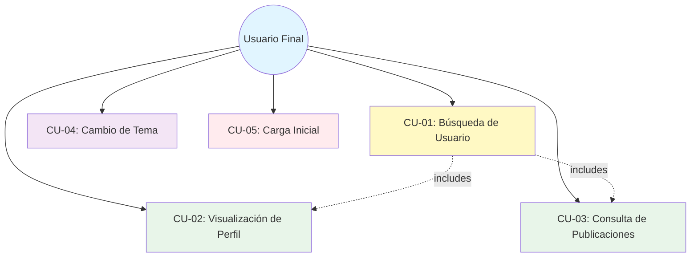

# 📋 Casos de Uso

> **Proyecto:** myprojectapi02  
> **Última Actualización:** 12 de Enero, 2026

---

## 🎭 Actores del Sistema

### Actor Principal

**👤 Usuario Final**
- **Descripción:** Persona que utiliza la aplicación web para buscar información de usuarios
- **Objetivos:** 
  - Buscar perfiles de usuarios por ID
  - Visualizar información detallada de usuarios
  - Consultar publicaciones de usuarios
- **Nivel Técnico:** No requiere conocimientos técnicos

---

## 📖 Casos de Uso Principales

### CU-01: Búsqueda de Usuario por ID

**Actor:** Usuario Final  
**Precondiciones:** 
- La aplicación está cargada en el navegador
- La API JSONPlaceholder está disponible

**Flujo Principal:**

1. El usuario visualiza la interfaz de búsqueda
2. El sistema muestra un campo de entrada para el ID del usuario
3. El usuario ingresa un ID numérico (1-10)
4. El sistema valida la entrada en tiempo real
5. El usuario hace clic en el botón "Buscar"
6. El sistema muestra skeletons de carga
7. El sistema realiza llamadas paralelas a la API:
   - GET `/users/:id`
   - GET `/users/:id/posts`
8. El sistema recibe los datos correctamente
9. El sistema renderiza el perfil del usuario y sus publicaciones
10. El usuario visualiza la información completa

**Postcondiciones:**
- El perfil del usuario se muestra en pantalla
- Las publicaciones del usuario se muestran en acordeones
- El estado de la aplicación es "succeeded"

**Flujos Alternativos:**

**FA-01: ID Inválido**
- **Paso 4:** El usuario ingresa un valor fuera del rango (< 1 o > 10)
- El sistema no permite la entrada
- El botón "Buscar" permanece deshabilitado
- Retorna al paso 3

**FA-02: Usuario No Encontrado (404)**
- **Paso 8:** La API retorna 404
- El sistema detecta el error
- El sistema muestra la tarjeta "Usuario No Encontrado"
- El sistema sugiere intentar con otro ID
- Retorna al paso 3

**FA-03: Error de Red**
- **Paso 7:** Falla la conexión a la API
- El sistema detecta el error
- El sistema muestra un mensaje de error
- El sistema ofrece un botón "Reintentar"
- Si el usuario hace clic en "Reintentar", retorna al paso 6

**FA-04: Usuario Sin Publicaciones**
- **Paso 8:** La API retorna usuario válido pero sin posts
- El sistema renderiza el perfil del usuario
- El sistema muestra mensaje "Este usuario aún no tiene publicaciones"
- Finaliza el caso de uso

---

### CU-02: Visualización de Perfil de Usuario

**Actor:** Usuario Final  
**Precondiciones:** 
- Se ha ejecutado exitosamente CU-01

**Flujo Principal:**

1. El sistema muestra la tarjeta de perfil del usuario
2. El usuario visualiza:
   - Avatar del usuario (generado dinámicamente)
   - Nombre completo
   - Nombre de usuario (@username)
   - Nombre de la empresa
   - Frase de la empresa (catchphrase)
   - Ciudad de residencia
   - Email (clickeable)
   - Sitio web (clickeable)
3. El usuario puede hacer hover sobre los íconos para ver tooltips
4. El usuario puede hacer clic en el email para abrir cliente de correo
5. El usuario puede hacer clic en el sitio web para abrirlo en nueva pestaña

**Postcondiciones:**
- El usuario ha visualizado la información completa del perfil

---

### CU-03: Consulta de Publicaciones

**Actor:** Usuario Final  
**Precondiciones:** 
- Se ha ejecutado exitosamente CU-01
- El usuario tiene publicaciones

**Flujo Principal:**

1. El sistema muestra la lista de publicaciones en acordeones
2. El usuario visualiza los títulos de las publicaciones
3. El usuario hace clic en un acordeón
4. El sistema expande el acordeón
5. El usuario lee el contenido de la publicación
6. El usuario puede hacer clic en otro acordeón
7. El sistema colapsa el anterior y expande el nuevo

**Postcondiciones:**
- El usuario ha consultado las publicaciones del usuario

---

### CU-04: Cambio de Tema Visual

**Actor:** Usuario Final  
**Precondiciones:** 
- La aplicación está cargada

**Flujo Principal:**

1. El usuario visualiza el botón de cambio de tema en el header
2. El usuario hace hover sobre el botón
3. El sistema muestra un tooltip con el tema actual
4. El usuario hace clic en el botón
5. El sistema cambia el tema (claro ↔ oscuro)
6. El sistema aplica transiciones suaves
7. El sistema persiste la preferencia en localStorage

**Postcondiciones:**
- El tema visual ha cambiado
- La preferencia está guardada

**Flujos Alternativos:**

**FA-01: Tema Persistido**
- **Paso 1:** El usuario regresa a la aplicación
- El sistema lee la preferencia de localStorage
- El sistema aplica el tema guardado
- Continúa con el flujo normal

---

### CU-05: Carga Inicial de la Aplicación

**Actor:** Usuario Final  
**Precondiciones:** 
- El usuario accede a la URL de la aplicación

**Flujo Principal:**

1. El navegador carga la aplicación
2. El sistema inicializa Redux Store
3. El sistema aplica el tema guardado (o tema por defecto)
4. El sistema ejecuta búsqueda automática del usuario ID 1
5. El sistema muestra skeletons de carga
6. El sistema obtiene datos del usuario ID 1
7. El sistema renderiza el perfil y publicaciones
8. El usuario visualiza la interfaz completa

**Postcondiciones:**
- La aplicación está lista para usar
- Se muestra el perfil del usuario ID 1 por defecto

---

## 🔄 Diagrama de Casos de Uso



---

## 📊 Matriz de Trazabilidad

| Caso de Uso | Prioridad | Complejidad | Estado | Componentes Involucrados |
|-------------|-----------|-------------|--------|--------------------------|
| CU-01 | Alta | Media | ✅ Implementado | UserSearchPage, useUser, userSlice, user-service |
| CU-02 | Alta | Baja | ✅ Implementado | UserProfile |
| CU-03 | Media | Baja | ✅ Implementado | PostList |
| CU-04 | Baja | Baja | ✅ Implementado | ThemeToggleButton, useTheme |
| CU-05 | Alta | Media | ✅ Implementado | App, main, useUser |

---

## 🎯 Reglas de Negocio

### RN-01: Validación de ID de Usuario
- El ID debe ser un número entero
- El rango válido es 1-10 (limitación de JSONPlaceholder)
- No se permiten valores negativos, decimales o no numéricos

### RN-02: Manejo de Estados Asíncronos
- El sistema debe mostrar feedback visual durante la carga
- Los skeletons deben coincidir con la estructura de los componentes reales
- El botón de búsqueda debe deshabilitarse durante la carga

### RN-03: Persistencia de Tema
- La preferencia de tema debe guardarse en localStorage
- Al recargar la página, debe aplicarse el tema guardado
- Si no hay tema guardado, usar tema claro por defecto

### RN-04: Manejo de Errores
- Todos los errores deben mostrarse con mensajes claros
- Los errores de red deben ofrecer opción de reintentar
- Los errores 404 deben distinguirse de otros errores

### RN-05: Carga Inicial
- Al cargar la aplicación, debe mostrarse automáticamente el usuario ID 1
- No debe requerirse acción del usuario para ver contenido inicial

---

## 🔍 Escenarios de Prueba

### Escenario 1: Búsqueda Exitosa
```
DADO que el usuario está en la página principal
CUANDO ingresa el ID "5" y hace clic en "Buscar"
ENTONCES el sistema muestra el perfil del usuario 5 y sus publicaciones
```

### Escenario 2: Usuario No Encontrado
```
DADO que el usuario está en la página principal
CUANDO ingresa el ID "99" y hace clic en "Buscar"
ENTONCES el sistema muestra la tarjeta "Usuario No Encontrado"
Y sugiere intentar con un ID entre 1 y 10
```

### Escenario 3: Error de Red
```
DADO que el usuario está en la página principal
Y la API JSONPlaceholder no está disponible
CUANDO hace clic en "Buscar"
ENTONCES el sistema muestra un mensaje de error
Y ofrece un botón "Reintentar"
```

### Escenario 4: Cambio de Tema
```
DADO que el usuario está en modo claro
CUANDO hace clic en el botón de cambio de tema
ENTONCES el sistema cambia a modo oscuro
Y guarda la preferencia en localStorage
```

### Escenario 5: Persistencia de Tema
```
DADO que el usuario ha seleccionado modo oscuro
CUANDO recarga la página
ENTONCES el sistema aplica automáticamente el modo oscuro
```

---

## 📝 Notas Adicionales

### Limitaciones Conocidas

1. **Rango de IDs:** Solo se pueden buscar usuarios del 1 al 10 (limitación de JSONPlaceholder)
2. **Sin Autenticación:** No hay sistema de login/registro
3. **Solo Lectura:** No se pueden crear, editar o eliminar usuarios/posts
4. **Dependencia de API Externa:** Si JSONPlaceholder cae, la app no funciona

### Futuras Mejoras

- [ ] Búsqueda por nombre de usuario
- [ ] Paginación de publicaciones
- [ ] Filtrado de publicaciones
- [ ] Favoritos de usuarios
- [ ] Historial de búsquedas
- [ ] Modo offline con caché

---

**Firma Digital:**  
🏛️ Arquitecto de Software Senior  
📅 12 de Enero, 2026
