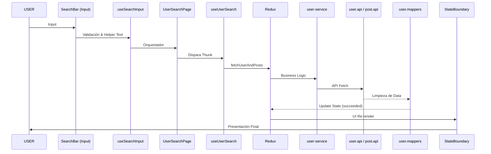

# 👨‍💻 Guía para Desarrolladores (v2.0)

Esta guía detalla el flujo de trabajo para extender y mantener `myprojectapi02`.

## 🔄 Ciclo de Vida de una Búsqueda (Diagrama de Secuencia)

El flujo de una búsqueda inteligente por nombre o ID sigue este camino:



## 🛠️ Cómo agregar un nuevo campo al perfil de usuario

Si necesitas mostrar un nuevo campo de la API externa, sigue estos pasos:

1.  **Mapper:** Agrega el campo en `src/features/user-search/api/user.mappers.js` dentro de `mapRawUser`.
2.  **UI:** Agregarlo en `src/features/user-search/components/UserProfile.jsx` usando el subcomponente `InfoItem`.
3.  **i18n:** Agrega la etiqueta correspondiente en `src/lib/translations.js`.
4.  **PropTypes:** No olvides actualizar las validaciones de tipos en los componentes.

## 🎨 Estándares de Estilo (Tailwind v4)

No utilices archivos CSS externos para componentes nuevos. Usa las utilidades de Tailwind v4:

- **Responsive:** `sm:`, `md:`, `lg:`.
- **Modo Oscuro:** `dark:`.
- **Animaciones:** `animate-in`, `fade-in`, `slide-in-from-bottom-4`.

```jsx
<div className="bg-white dark:bg-slate-800 transition-colors duration-300">
    {/* El color se adapta automáticamente al tema */}
</div>
```

## 📝 Documentación JSDoc

Es obligatorio documentar cada nuevo Hook o Componente siguiendo este patrón:

```js
/**
 * Descripción clara del componente.
 * @component
 * @category CategoryName
 * @param {Type} name - Descripción.
 * @returns {JSX.Element}
 */
```

## 🌐 Manejo de Traducciones (i18n)

Usa siempre el hook `useTranslation` para textos visibles al usuario:

```jsx
import { useTranslation } from "@/hooks/useTranslation";

function MiComponente() {
    const { t } = useTranslation();
    return <p>{t("mi_clave_de_traduccion")}</p>;
}
```
