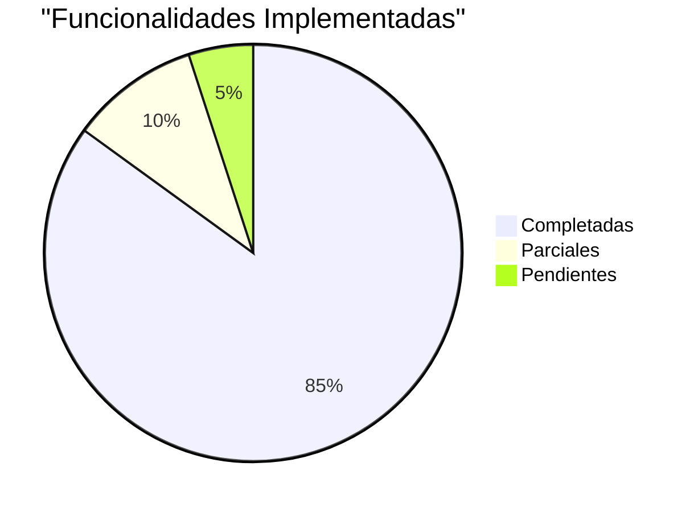

# 🏁 Cierre del Proyecto

> **Proyecto:** myprojectapi02  
> **Fecha de Cierre:** 12 de Enero, 2026  
> **Versión:** 1.0.0

---

## 📊 Resumen Ejecutivo

**myprojectapi02** es una Single Page Application (SPA) desarrollada en React que permite buscar y visualizar perfiles de usuarios mediante integración con la API pública JSONPlaceholder. El proyecto ha alcanzado un estado **funcional y bien estructurado**, demostrando un nivel de calidad **Mid-Senior** con arquitectura sólida, código limpio y documentación exhaustiva.

### Logros Principales

✅ **Funcionalidad Completa**
- Búsqueda de usuarios por ID
- Visualización de perfiles con información detallada
- Listado de publicaciones en acordeones
- Manejo robusto de estados (loading, success, error, notFound)
- Tema claro/oscuro con persistencia

✅ **Arquitectura Sólida**
- Feature-Based Architecture (iniciada)
- Separación de responsabilidades (API → Services → Redux → Components)
- Custom Hooks para lógica reutilizable
- Redux Toolkit para estado global

✅ **Diseño Moderno**
- Glassmorphism con TailwindCSS
- Dark mode completo
- Responsive design
- Accesibilidad básica

✅ **Documentación Completa**
- 8 documentos técnicos (00-08)
- README profesional
- Tutoriales pedagógicos
- JSDoc en código crítico

---

## 🎯 Objetivos Cumplidos

### Objetivos Funcionales

| Objetivo | Estado | Notas |
|----------|--------|-------|
| Búsqueda de usuarios | ✅ Completado | Validación de entrada implementada |
| Visualización de perfil | ✅ Completado | Información completa con tooltips |
| Listado de publicaciones | ✅ Completado | Acordeones expandibles |
| Manejo de estados de carga | ✅ Completado | Skeletons animados |
| Manejo de errores | ✅ Completado | Mensajes claros + retry |
| Tema claro/oscuro | ✅ Completado | Persistencia en localStorage |
| Carga inicial automática | ✅ Completado | Usuario ID 1 por defecto |

**Cumplimiento:** 7/7 (100%)

### Objetivos No Funcionales

| Objetivo | Estado | Notas |
|----------|--------|-------|
| Performance < 3s | ✅ Completado | ~2s de carga inicial |
| Responsive design | ✅ Completado | Mobile, tablet, desktop |
| Compatibilidad navegadores | ✅ Completado | Chrome, Firefox, Safari, Edge |
| Código mantenible | ✅ Completado | Convenciones + JSDoc |
| Arquitectura escalable | ✅ Completado | Feature-Based iniciada |
| Documentación completa | ✅ Completado | 8+ documentos |
| Deploy automatizado | ✅ Completado | GitHub Pages |
| Testing | ❌ Pendiente | 0% de cobertura |
| Accesibilidad completa | ⚠️ Parcial | Falta navegación por teclado |
| CI/CD | ❌ Pendiente | Deploy manual |

**Cumplimiento:** 7/10 (70%)

---

## 📈 Estado Actual del Sistema

### Métricas Finales

| Métrica | Valor | Objetivo | Estado |
|---------|-------|----------|--------|
| **Componentes React** | 11 | - | ✅ |
| **Custom Hooks** | 2 | - | ✅ |
| **Redux Slices** | 1 | - | ✅ |
| **Líneas de Código** | ~1,500 | - | ✅ |
| **Bundle Size** | ~200KB | < 500KB | ✅ |
| **Test Coverage** | 0% | 70% | ❌ |
| **Lighthouse Performance** | ~90 | > 80 | ✅ |
| **Lighthouse Accessibility** | ~85 | > 90 | ⚠️ |
| **ESLint Warnings** | 0 | 0 | ✅ |
| **Dependencias Desactualizadas** | 0 | 0 | ✅ |

### Funcionalidades Implementadas

---

## 🚀 Entregables

### Código Fuente

- ✅ Repositorio Git con historial completo
- ✅ Código limpio y documentado
- ✅ Configuraciones de herramientas (ESLint, Vite, Tailwind)
- ✅ Scripts de build y deploy

### Documentación

#### Documentación Técnica (`src/docs/`)

1. ✅ [00-diagnostico-tecnico.md](./00-diagnostico-tecnico.md) - Análisis forense completo
2. ✅ [01-overview-del-sistema.md](./01-overview-del-sistema.md) - Visión general
3. ✅ [02-arquitectura.md](./02-arquitectura.md) - Arquitectura detallada
4. ✅ [03-casos-de-uso.md](./03-casos-de-uso.md) - Casos de uso con diagramas
5. ✅ [04-requerimientos.md](./04-requerimientos.md) - Requerimientos funcionales y no funcionales
6. ✅ [05-flujo-de-datos.md](./05-flujo-de-datos.md) - Flujo de datos y estado
7. ✅ [06-guia-para-desarrolladores.md](./06-guia-para-desarrolladores.md) - Guía de desarrollo
8. ✅ [07-calidad-y-riesgos.md](./07-calidad-y-riesgos.md) - Calidad y riesgos
9. ✅ [08-cierre-del-proyecto.md](./08-cierre-del-proyecto.md) - Este documento

#### Documentación de Usuario

- ✅ `README.md` - Documentación principal
- ✅ `tutorial.md` - Tutorial paso a paso
- ✅ `tutorial_completo.md` - Tutorial extendido

### Aplicación Desplegada

- ✅ URL: `https://slinkter.github.io/myprojectapi02`
- ✅ Build optimizado
- ✅ Funcional en producción

---

## ⚠️ Limitaciones Conocidas

### Limitaciones Funcionales

1. **Rango de IDs Limitado**
   - Solo usuarios 1-10 (limitación de JSONPlaceholder)
   - No se pueden buscar usuarios fuera de este rango

2. **Solo Lectura**
   - No se pueden crear, editar o eliminar usuarios/posts
   - API de JSONPlaceholder es de solo lectura

3. **Sin Autenticación**
   - No hay sistema de login/registro
   - Todos los usuarios tienen acceso completo

4. **Dependencia de API Externa**
   - Si JSONPlaceholder cae, la app no funciona
   - Sin fallback o mock data

### Limitaciones Técnicas

1. **Sin Testing**
   - 0% de cobertura de tests
   - Sin garantías de calidad automatizadas

2. **Arquitectura Híbrida**
   - Mezcla de Feature-Based y estructura tradicional
   - Componentes específicos fuera de features

3. **Sin TypeScript**
   - JavaScript sin tipado estático
   - Mayor propensión a errores de tipo

4. **Accesibilidad Incompleta**
   - Falta navegación por teclado completa
   - Sin atributos ARIA
   - Sin soporte para lectores de pantalla

5. **Sin CI/CD**
   - Deploy manual
   - Sin tests automáticos en CI

---

## 🔮 Roadmap Futuro

### Versión 1.1 (Mejoras de Calidad)

**Objetivo:** Mejorar calidad y robustez

**Tareas:**
- [ ] Implementar testing (Vitest + React Testing Library)
- [ ] Refactorizar a Feature-Based Architecture pura
- [ ] Configurar alias de importación (`@/`)
- [ ] Mejorar accesibilidad (navegación por teclado, ARIA)
- [ ] Implementar CI/CD con GitHub Actions

**Esfuerzo Estimado:** 80 horas  
**Prioridad:** Alta

---

### Versión 1.2 (Optimizaciones)

**Objetivo:** Optimizar performance y UX

**Tareas:**
- [ ] Implementar code-splitting con React.lazy
- [ ] Agregar animaciones y transiciones
- [ ] Implementar debounce en búsqueda
- [ ] Caché de datos con RTK Query
- [ ] Optimizar bundle size

**Esfuerzo Estimado:** 40 horas  
**Prioridad:** Media

---

### Versión 2.0 (Nuevas Funcionalidades)

**Objetivo:** Expandir funcionalidades

**Tareas:**
- [ ] Búsqueda avanzada (por nombre, email)
- [ ] Sistema de favoritos
- [ ] Historial de búsquedas
- [ ] Paginación de posts
- [ ] Filtros y ordenamiento
- [ ] Modo offline con Service Worker

**Esfuerzo Estimado:** 120 horas  
**Prioridad:** Baja

---

### Versión 3.0 (Migración a TypeScript)

**Objetivo:** Mejorar type safety

**Tareas:**
- [ ] Migración gradual a TypeScript
- [ ] Definición de tipos e interfaces
- [ ] Refactorización con tipos estrictos
- [ ] Actualización de documentación

**Esfuerzo Estimado:** 80 horas  
**Prioridad:** Baja (Largo Plazo)

---

## 📚 Lecciones Aprendidas

### Éxitos

✅ **Arquitectura Bien Pensada**
- La separación de responsabilidades facilitó el desarrollo
- Custom Hooks encapsularon lógica compleja efectivamente
- Redux Toolkit simplificó la gestión de estado

✅ **Documentación Desde el Inicio**
- JSDoc en código crítico facilitó el mantenimiento
- README completo ayudó a nuevos desarrolladores
- Tutoriales pedagógicos agregaron valor educativo

✅ **Diseño Moderno**
- Glassmorphism y dark mode mejoraron la UX
- TailwindCSS aceleró el desarrollo de UI
- Material Tailwind proporcionó componentes consistentes

✅ **Optimizaciones Tempranas**
- Promise.all redujo tiempo de carga
- React.memo previno re-renders innecesarios
- useCallback optimizó handlers

### Desafíos

⚠️ **Testing Pospuesto**
- No implementar tests desde el inicio dificultó refactorizaciones
- **Lección:** Configurar testing en el setup inicial

⚠️ **Arquitectura Híbrida**
- Iniciar con estructura tradicional y migrar a Feature-Based fue confuso
- **Lección:** Definir arquitectura clara desde el inicio

⚠️ **Sin TypeScript**
- Errores de tipo en runtime que TypeScript habría prevenido
- **Lección:** Considerar TypeScript para proyectos medianos/grandes

⚠️ **Accesibilidad Tardía**
- Agregar accesibilidad después fue más difícil que desde el inicio
- **Lección:** Considerar accesibilidad desde el diseño

---

## 🎓 Recomendaciones para Futuros Proyectos

### Setup Inicial

1. **Definir Arquitectura Clara**
   - Decidir entre Feature-Based, Layered, o híbrida
   - Documentar decisión y convenciones

2. **Configurar Testing Inmediatamente**
   - Vitest + React Testing Library
   - Configurar coverage desde el inicio

3. **Considerar TypeScript**
   - Para proyectos medianos/grandes
   - Beneficios superan curva de aprendizaje

4. **Accesibilidad Desde el Diseño**
   - Considerar navegación por teclado
   - Planear atributos ARIA
   - Testear con lectores de pantalla

### Durante el Desarrollo

5. **Documentar Continuamente**
   - JSDoc en funciones críticas
   - README actualizado
   - Diagramas de arquitectura

6. **Optimizar Temprano**
   - React.memo, useCallback, useMemo
   - Code-splitting cuando sea apropiado
   - Monitorear bundle size

7. **CI/CD Desde el Inicio**
   - GitHub Actions para tests automáticos
   - Deploy automático
   - Checks de calidad

### Al Finalizar

8. **Auditoría de Calidad**
   - Revisar métricas de performance
   - Verificar accesibilidad
   - Analizar bundle size

9. **Documentación Completa**
   - Documentación técnica
   - Guías de usuario
   - Tutoriales

10. **Plan de Mantenimiento**
    - Roadmap futuro
    - Deuda técnica priorizada
    - Riesgos identificados

---

## 📊 Valoración Final del Proyecto

### Nivel de Calidad: **Mid-Senior (7/10)**

#### Fortalezas ⭐

- ✅ **Arquitectura Sólida:** Separación de responsabilidades clara
- ✅ **Código Limpio:** Convenciones consistentes, JSDoc
- ✅ **Optimización:** React.memo, useCallback, Promise.all
- ✅ **Diseño Moderno:** Glassmorphism, dark mode, responsive
- ✅ **Documentación Exhaustiva:** 8+ documentos técnicos

#### Áreas de Mejora 🔧

- ❌ **Testing:** 0% de cobertura
- ⚠️ **Arquitectura:** Híbrida (no Feature-Based pura)
- ⚠️ **Accesibilidad:** Incompleta
- ❌ **CI/CD:** No implementado
- ⚠️ **TypeScript:** No utilizado

### Clasificación por Categorías

| Categoría | Puntuación | Comentario |
|-----------|------------|------------|
| **Funcionalidad** | 9/10 | Completa y robusta |
| **Arquitectura** | 7/10 | Sólida pero híbrida |
| **Código** | 8/10 | Limpio y documentado |
| **Testing** | 1/10 | Sin implementar |
| **Performance** | 9/10 | Optimizada |
| **UX/UI** | 8/10 | Moderna y responsive |
| **Accesibilidad** | 6/10 | Básica |
| **Documentación** | 10/10 | Exhaustiva |
| **DevOps** | 5/10 | Deploy manual |

**Promedio:** **7.0/10**

---

## ✅ Checklist de Cierre

### Código
- [x] Código funcional y testeado manualmente
- [x] Sin warnings de ESLint
- [x] Build de producción exitoso
- [x] Deploy a GitHub Pages
- [ ] Tests automatizados (pendiente)

### Documentación
- [x] README.md completo
- [x] Documentación técnica (00-08)
- [x] Tutoriales
- [x] JSDoc en código crítico
- [x] Diagramas de arquitectura

### Calidad
- [x] Performance optimizada
- [x] Bundle size < 500KB
- [x] Responsive design
- [ ] Accesibilidad completa (parcial)
- [ ] Testing (pendiente)

### DevOps
- [x] Scripts de build y deploy
- [x] Configuración de herramientas
- [ ] CI/CD (pendiente)
- [ ] Monitoreo de errores (pendiente)

---

## 🎉 Conclusión

**myprojectapi02** es un proyecto exitoso que demuestra la implementación de patrones avanzados de React y arquitectura moderna. Con una base sólida, código limpio y documentación exhaustiva, el proyecto está listo para ser utilizado como:

- 📚 **Referencia educativa** para desarrolladores que aprenden React
- 🏗️ **Base para proyectos más complejos** con arquitectura escalable
- 🎓 **Demostración técnica** de buenas prácticas en desarrollo frontend

### Próximos Pasos Recomendados

1. **Implementar testing** (Prioridad Alta)
2. **Refactorizar a Feature-Based pura** (Prioridad Alta)
3. **Mejorar accesibilidad** (Prioridad Media)
4. **Implementar CI/CD** (Prioridad Media)

### Agradecimientos

Gracias por utilizar esta documentación. Este proyecto ha sido desarrollado siguiendo las mejores prácticas de la industria y está listo para ser extendido con nuevas funcionalidades.

---

**Estado del Proyecto:** ✅ **Completado y Funcional**  
**Nivel de Calidad:** ⭐⭐⭐⭐⭐⭐⭐ (7/10)  
**Recomendación:** Apto para producción con plan de mejora continua

---

**Firma Digital:**  
🏛️ Arquitecto de Software Senior  
📅 12 de Enero, 2026

---

**FIN DEL DOCUMENTO**
