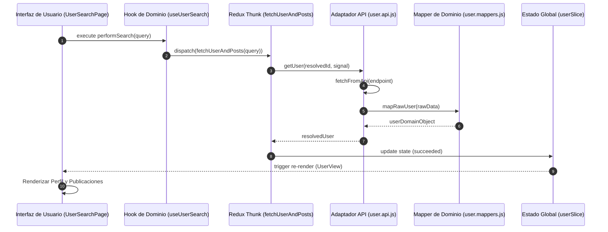
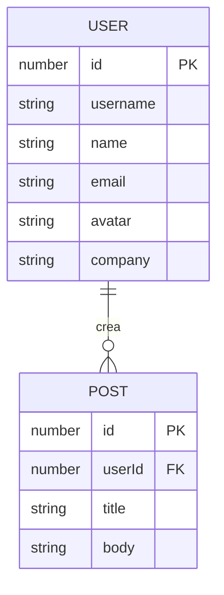

# Diagramas Técnicos - UserApp Pro

Este documento contiene las representaciones visuales de la arquitectura, flujos de datos y relaciones de dominio del sistema.

## 1. Diagrama de Secuencia: Flujo de Recuperación de Datos
Este diagrama ilustra el ciclo de vida completo de una petición, desde la interacción del usuario hasta la actualización de la interfaz.



## 2. Diagrama de Casos de Uso: Búsqueda de Perfil
Describe las interacciones del usuario final con la funcionalidad de búsqueda.

```mermaid
useCaseDiagram
    actor Usuario
    package "Módulo de Búsqueda" {
        usecase "Buscar Usuario por ID/Nombre" as UC1
        usecase "Visualizar Perfil Detallado" as UC2
        usecase "Visualizar Lista de Publicaciones" as UC3
        usecase "Manejar Error de Búsqueda" as UC4
        usecase "Reintentar Búsqueda" as UC5
    }

    Usuario --> UC1
    UC1 ..> UC2 : <<include>>
    UC1 ..> UC3 : <<include>>
    UC1 ..> UC4 : <<extend>>
    UC4 ..> UC5 : <<extend>>
```

## 3. Diagrama de Entidad-Relación (ER)
Representa la estructura de datos del dominio y las relaciones entre las entidades principales.


