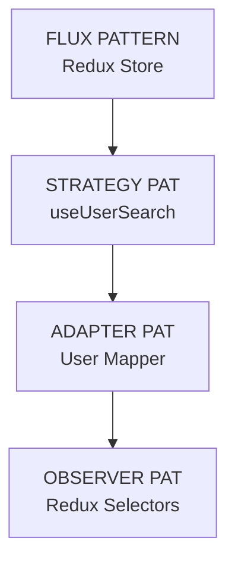
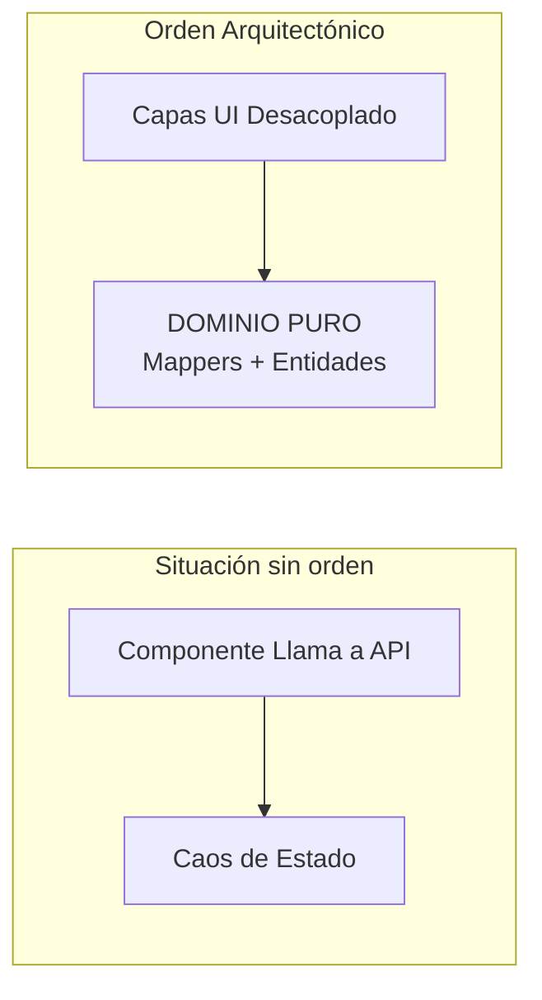
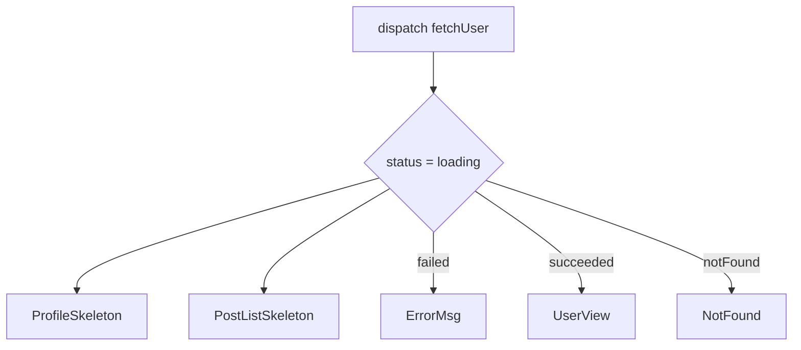
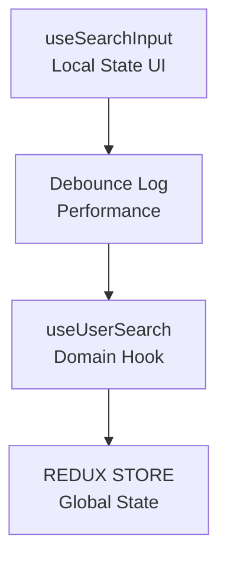

# 🎓 Masterclass de Ingeniería: myprojectapi02 (v2.1)

Este documento no es una guía de uso, es una **disección técnica** de las decisiones de arquitectura que convierten a este sistema en una herramienta de grado empresarial.

---

## 🗺️ Mapa de Patrones de Diseño (Pattern Mapping)



---

## 🏗️ SECCIÓN 1: El Problema — SPA y el Caos de Estado



---

## 🛡️ SECCIÓN 2: El Patrón Data Mapper — Programación Defensiva

```mermaid
graph LR
    A[API RAW<br/>{ id: 1 }] -->|mapRawUser| B[DATA MAPPER]
    B --> C[DOMINIO SEGURO<br/>{ id: 1 }]
```

---

## 💀 SECCIÓN 3: StateBoundary — El Patrón Declarativo



---

## 🎣 SECCIÓN 4: Orquestación de Hooks (SRP)



---
*Documento generado bajo estándares de Senior Frontend Architecture.*
