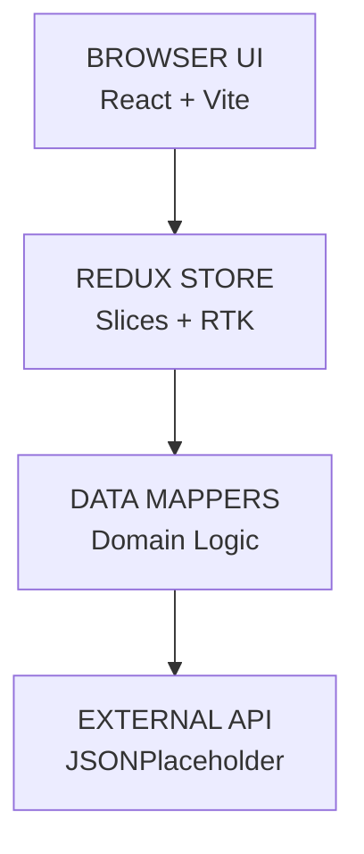
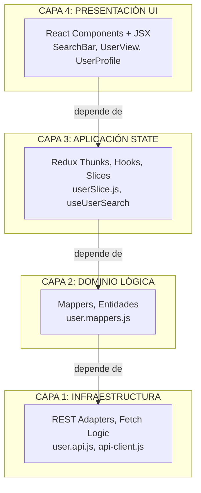
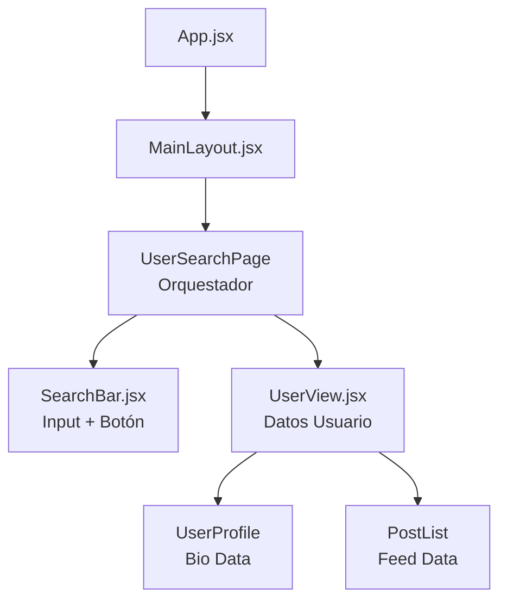
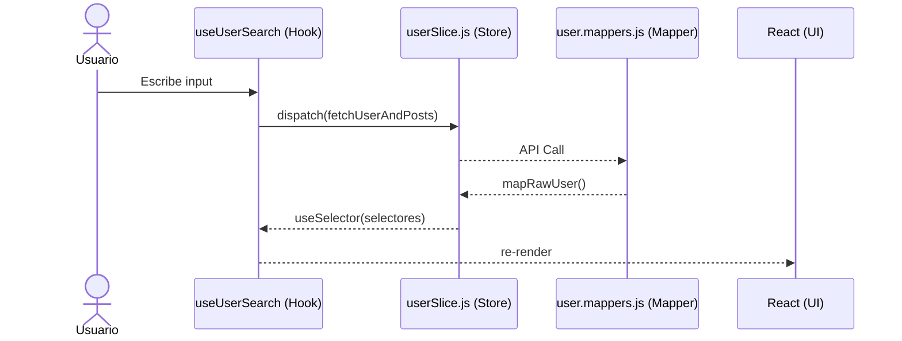
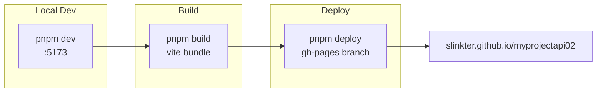
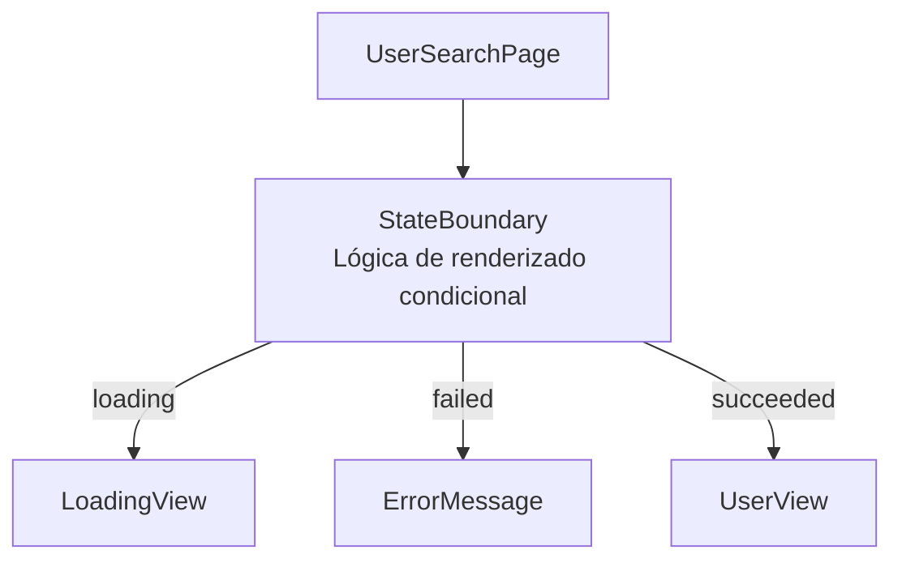
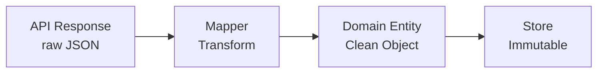
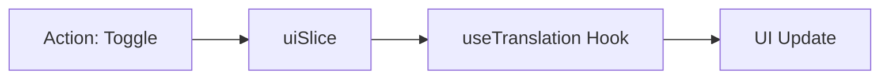

# 🏗️ Arquitectura del Sistema: Clean Architecture (v2.1)

Este proyecto implementa una **Arquitectura de Capas (Onion Architecture)** adaptada al ecosistema React/Redux para garantizar el desacoplamiento total de la infraestructura y el dominio.

---

## 📐 Vista General del Sistema

---

## 🧩 Clean Architecture (4 Capas)

---

## 🌳 Árbol de Componentes

---

## 🔄 Flujo de Datos End-to-End (Redux Cycle)

---

## 🚀 Pipeline de Deploy (GitHub Pages)

---

## 🧩 Patrones de Diseño Implementados

### 1. State Boundary (UI Pattern)
Utilizamos el patrón de composición para centralizar la gestión de estados asíncronos (`loading`, `error`, `notFound`).

### 2. Data Mappers (Architectural Pattern)
Para cumplir con el desacoplamiento de infraestructuras externas (JSONPlaceholder), implementamos Mappers que transforman la data cruda en entidades de dominio limpias.

### 3. Smart vs Dumb Components
- **Smart:** `UserSearchPage.jsx`. Conoce el estado, los hooks y orquesta la vista.
- **Dumb:** `SearchBar.jsx`, `UserProfile.jsx`, `PostList.jsx`. Solo reciben props y renderizan UI pura.

## 🌐 Internacionalización (i18n)

Implementado mediante un sistema de diccionarios reactivos en `src/lib/translations.js` y gestionado globalmente por `uiSlice`.

## 🎨 Estilos con Tailwind v4

Hemos migrado a **Tailwind CSS v4 puro**, eliminando todas las librerías de componentes externas.
- **Configuración:** Integrada directamente en `vite.config.js` vía `@tailwindcss/vite`.
- **Temas:** Variables definidas en la capa `@theme` dentro de `src/index.css`.
- **Modo Oscuro:** Basado en la clase `.dark` en el elemento raíz HTML.

---
*Documento generado bajo estándares de Senior Frontend Architecture.*
