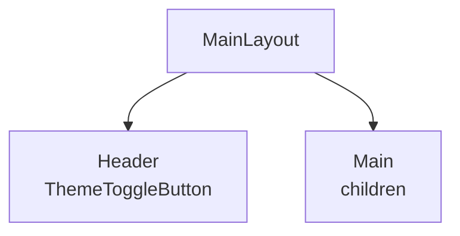

# MainLayout

## Descripción
Contenedor principal de la aplicación. Proporciona la estructura base, gestiona el fondo según el tema (claro/oscuro) e incluye el botón de alternancia de tema.

## Ubicación
`src/components/layout/MainLayout.jsx`

## Props

| Prop | Tipo | Requerido | Default | Descripción |
|------|------|-----------|---------|-------------|
| children | node | ✅ | - | Elementos hijos a renderizar. |

## Uso
```jsx
<MainLayout>
  <UserSearchPage />
</MainLayout>
```

## Estados internos
- Tema oscuro aplicado via clase `dark` en HTML.

## Dependencias
- `ThemeToggleButton`: Botón de cambio de tema.
- Utils: `cn`.

## Diagrama

