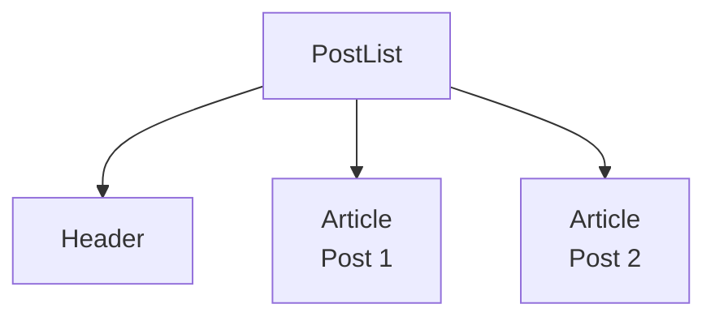

# PostList

## Descripción
Lista responsiva de publicaciones asociadas a un usuario. Implementa estados vacíos y efectos de hover sobre cada publicación.

## Ubicación
`src/features/user-search/components/PostList.jsx`

## Props

| Prop | Tipo | Requerido | Default | Descripción |
|------|------|-----------|---------|-------------|
| userPosts | array | ✅ | [] | Lista de objetos de post. |

## Uso
```jsx
<PostList userPosts={posts} />
```

## Estados internos
- Ninguno (Presentacional).

## Dependencias
- Utils: `cn`.

## Diagrama

