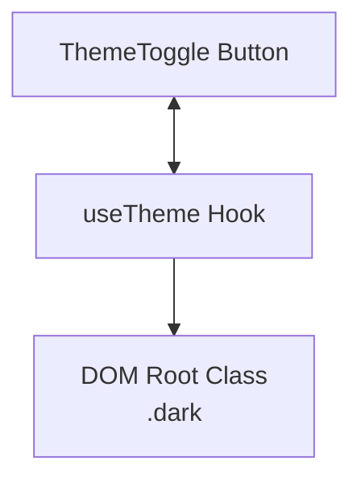

# ThemeToggleButton

## Descripción
Botón interactivo que permite alternar entre el modo claro (`light`) y el modo oscuro (`dark`). Gestiona la persistencia del tema en `localStorage` y aplica dinámicamente la clase `.dark` al elemento raíz del DOM.

## Ubicación
`src/components/ui/ThemeToggleButton.jsx`

## Props

| Prop | Tipo | Requerido | Default | Descripción |
|------|------|-----------|---------|-------------|
| — | — | — | — | Este componente no recibe props (self-contained). |

## Uso
```jsx
import ThemeToggleButton from '@/components/ui/ThemeToggleButton'

<ThemeToggleButton />
```

## Estados internos
- `isDark`: Booleano que indica si el tema oscuro está activo (consumido vía `useTheme`).

## Dependencias
- Hooks: `useTheme`
- Libs: `cn` (utils)
- Icons: `SunIcon`, `MoonIcon` (@heroicons/react)

## Diagrama

