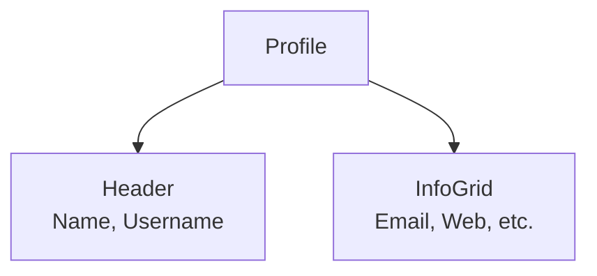

# UserProfile

## Descripción
Tarjeta detallada que presenta la información de perfil de un usuario, incluyendo contacto, sitio web, empresa y dirección.

## Ubicación
`src/features/user-search/components/UserProfile.jsx`

## Props

| Prop | Tipo | Requerido | Default | Descripción |
|------|------|-----------|---------|-------------|
| user | object | ✅ | — | Objeto de usuario sanitizado. |

## Uso
```jsx
<UserProfile user={user} />
```

## Estados internos
- Ninguno (Presentacional).

## Dependencias
- Componentes: `InfoItem` (interno).
- Iconos: `UserIcon`, `EnvelopeIcon`, `GlobeAltIcon`, etc.
- Utils: `cn`.

## Diagrama

