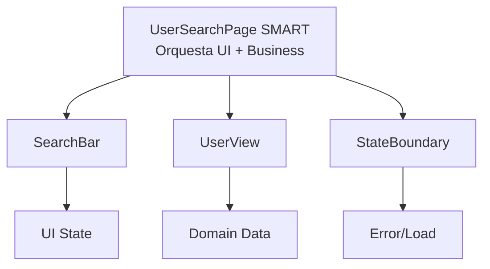

# UserSearchPage

## Descripción
Orquestador principal del dominio de búsqueda de usuarios. Coordina la entrada del usuario, la validación del input, la comunicación con la API (vía Redux) y la gestión de estados asíncronos mediante el patrón `StateBoundary`.

## Ubicación
`src/features/user-search/UserSearchPage.jsx`

## Props
| Prop | Tipo | Requerido | Default | Descripción |
|------|------|-----------|---------|-------------|
| — | — | — | — | Componente de nivel de página (Page Orchestrator). |

## Uso
```jsx
import UserSearchPage from '@/features/user-search/UserSearchPage'

<UserSearchPage />
```

## Estados internos
- **UI State (`useSearchInput`)**:
  - `searchValue`: Término actual de búsqueda.
  - `hasError`: Estado de validación del input.
- **Domain State (`useUserSearch`)**:
  - `user`: Perfil del usuario actual.
  - `posts`: Lista de publicaciones del usuario.
  - `status`: Estado de la petición (`loading`, `succeeded`, etc.).

## Dependencias
- **Componentes hijos**: `SearchBar`, `UserView`, `StateBoundary`, `ProfileSkeleton`, `PostListSkeleton`.
- **Hooks**: `useUserSearch`, `useSearchInput`.
- **Store Redux**: Consume `userSlice` a través de los hooks de dominio.

## Diagrama

