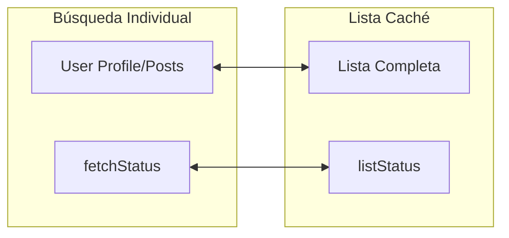

# 🧠 User Store: userSlice.js (v2.1)

Este documento detalla la estructura del estado global para la gestión de usuarios, sus thunks asíncronos y los selectores optimizados.

---

## 🏗️ Estructura del Initial State



---

## 🔄 Ciclo de Vida de fetchUserAndPosts

El Thunk gestiona 5 estados para la UI:

1.  **`idle`**: Estado inicial.
2.  **`loading`**: Petición en curso (Skeletons activos).
3.  **`succeeded`**: Datos recuperados y mapeados.
4.  **`notFound`**: Respuesta exitosa pero vacía (Error 404 mapeado).
5.  **`failed`**: Error de infraestructura o red.

---

## 📊 Tabla de Acciones y Thunks

| Acción | Tipo | Descripción |
|---|---|---|
| `fetchUserAndPosts` | Async Thunk | Recupera perfil + posts por ID. |
| `fetchUsersList` | Async Thunk | Carga la lista completa para búsqueda local. |
| `resetUserState` | Reducer | Limpia el perfil actual. |

---

## 🎯 Selectores (Directos y Memoizados)

Mantenemos accesos directos para datos simples, pero hemos reintroducido **`createSelector`** (Reselect) para la caché de usuarios. Esto evita re-cálculos innecesarios y re-renders excesivos en la UI cuando se realiza la búsqueda por nombre en la lista en caché, optimizando drásticamente el rendimiento del hook de búsqueda.

| Selector | Retorna | Cuándo Usar |
|---|---|---|
| `selectCurrentUserProfile` | `Object | null` | Mostrar datos del usuario. |
| `selectCurrentUserPosts` | `Array` | Renderizar la lista de posts. |
| `selectUserFetchStatus` | `string` | Para el `StateBoundary`. |
| `selectUserFetchError` | `string | null` | Mostrar mensaje de error. |
| `selectMemoizedUserList` | `Array` | Búsqueda por nombre en el hook (Memoizado con `createSelector`). |

---

## 🛠️ Ejemplo de Uso en Componente

```javascript
import { useSelector } from "react-redux";
import { selectCurrentUserProfile } from "../store/userSlice";

const UserHeader = () => {
  const user = useSelector(selectCurrentUserProfile);
  if (!user) return null;
  return <h1>{user.name}</h1>;
};
```

---
*Documento generado bajo estándares de Senior Frontend Architecture.*
